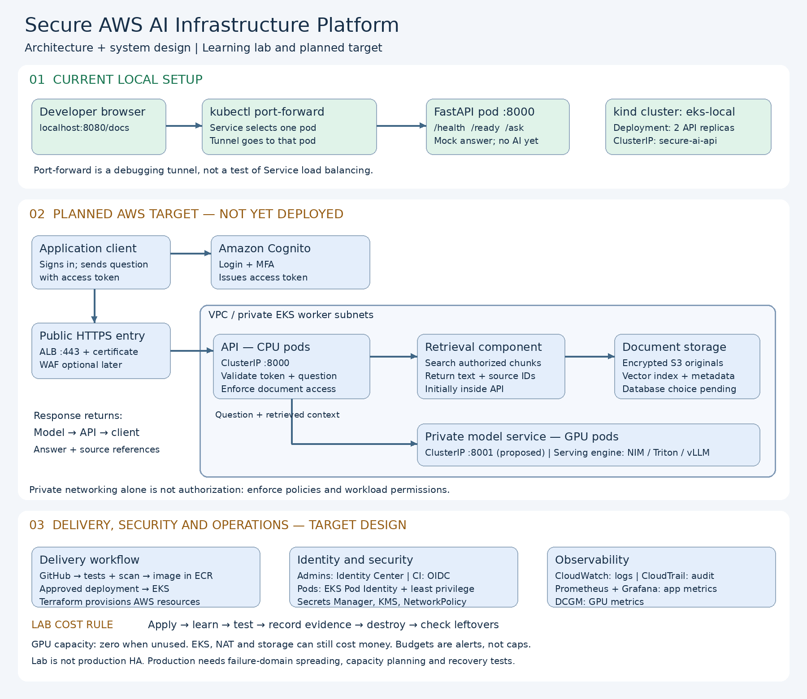
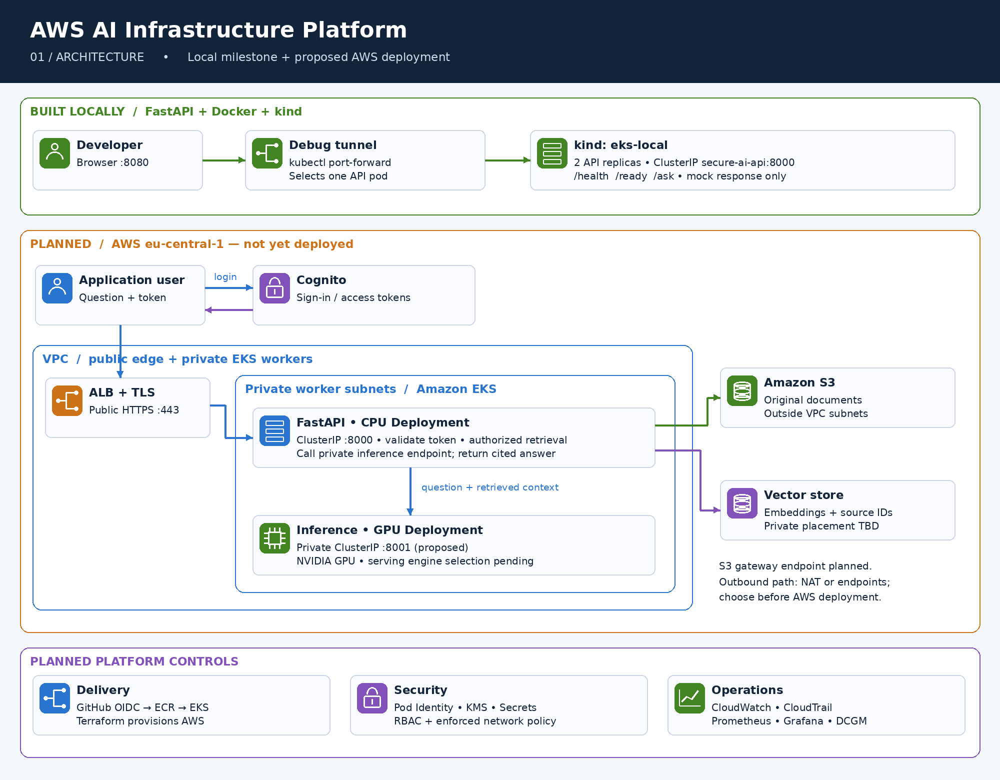
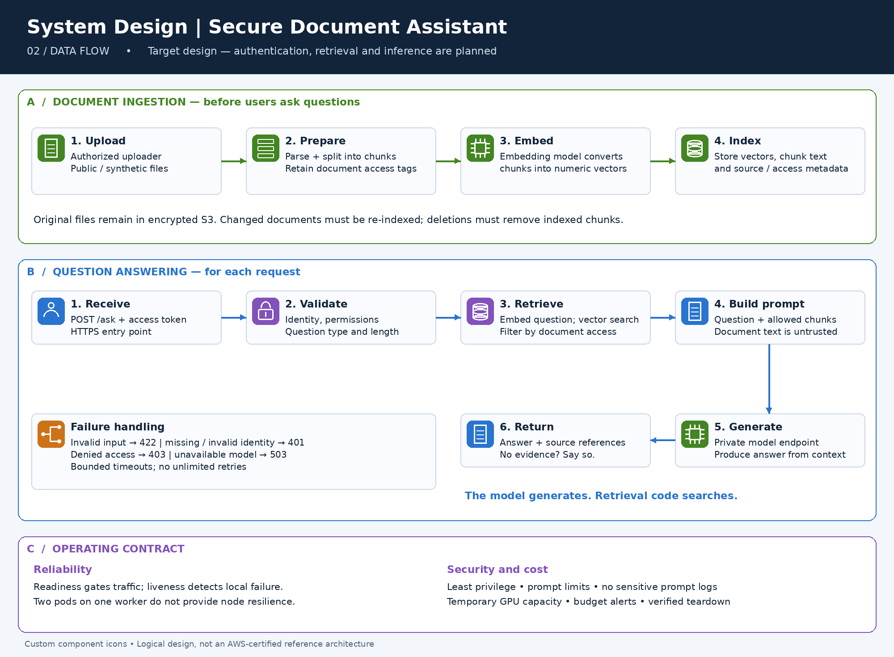
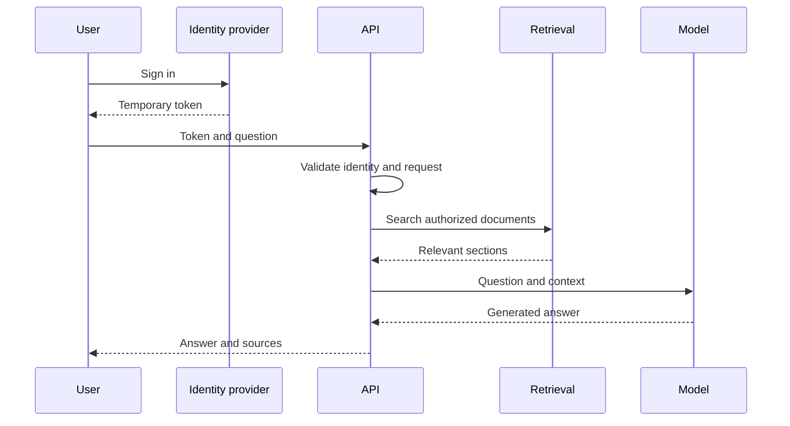

# aws-ai-infrastructure-platform

Production-style AI infrastructure using AWS, Terraform, EKS, NVIDIA GPUs, secure CI/CD, monitoring and cost controls.





## System Design

### 1. Project goal

Build a secure, observable and cost-controlled platform that answers user questions using information retrieved from approved documents.

### 2. Example use case

A user asks:

> What is the company password policy?

The system searches approved security documents, finds the relevant section, sends that section with the question to the model, and returns an answer with the source document.

### 3. Functional requirements

The system must:

1. Authenticate application users.
2. Validate incoming questions.
3. Check which documents the user may access.
4. Find relevant document sections.
5. Send the question and context to the model.
6. Return the answer and sources.
7. Record logs, metrics and errors.
8. Provide health and readiness endpoints.

### 4. Non-functional requirements

| Area | Requirement |
|---|---|
| Security | Temporary credentials, least privilege and encryption |
| Availability | Multiple API replicas and health checks |
| Scalability | API and model scale independently |
| Performance | Configure model timeouts and resource limits |
| Observability | Central logs, metrics and alerts |
| Cost | GPU nodes remain at zero when unused |
| Recovery | Recreate infrastructure from Git and Terraform |
| Privacy | Use only public or synthetic lab documents |

### 5. Request flow



### 6. Component responsibilities

| Component | Responsibility |
|---|---|
| API | Authentication, validation and workflow control |
| Retrieval service | Search relevant authorized content |
| Vector database | Store searchable document representations |
| Model service | Generate an answer from the supplied context |
| S3 | Store encrypted source documents |
| Kubernetes | Schedule, restart and scale containers |
| Terraform | Create and destroy AWS infrastructure |
| GitHub Actions | Test, scan, build and deploy |
| Monitoring | Detect availability, performance and GPU problems |

### 7. API design

| Method | Endpoint | Authentication | Purpose |
|---|---|---:|---|
| GET | `/health` | Internal/public health check | Process health |
| GET | `/ready` | Internal | Dependency readiness |
| POST | `/ask` | Required later | Submit a question |
| POST | `/documents` | Administrator later | Upload a document |
| GET | `/metrics` | Internal only | Operational metrics |

### 8. Availability design

- Run at least two API replicas.
- Use readiness probes to remove unhealthy pods from service.
- Use liveness probes to restart failed containers.
- Use a Kubernetes Service as the stable address.
- Keep the model independent from the API.
- Return HTTP 503 if the model is temporarily unavailable.

### 9. Scaling design

```text
API service:
CPU workload -> multiple inexpensive replicas

Model service:
GPU workload -> fewer expensive replicas
```

API and model services must scale independently.

### 10. Security design

- Application users authenticate with temporary tokens.
- Administrators use IAM Identity Center.
- GitHub Actions uses OIDC instead of permanent AWS keys.
- Pods use dedicated workload identities.
- Containers run as non-root.
- S3 public access is blocked.
- Data and secrets are encrypted.
- Network policies restrict API-to-model traffic.
- Container images and dependencies are scanned.

### 11. Configuration design

Configuration is supplied through environment variables:

```text
APP_ENV=local
LOG_LEVEL=INFO
MODEL_BASE_URL=http://model-service:8001
MODEL_TIMEOUT_SECONDS=30
```

Secrets are stored separately:

```text
Local development -> ignored .env file
AWS environment   -> AWS Secrets Manager
```

### 12. Failure scenarios

| Failure | Expected response |
|---|---|
| API pod fails | Deployment creates a replacement |
| Readiness fails | Service stops sending traffic to that pod |
| Model unavailable | API returns controlled HTTP 503 |
| Invalid question | API returns HTTP 422 |
| Missing authentication | API returns HTTP 401 |
| Insufficient permission | API returns HTTP 403 |
| GPU capacity unavailable | Model pod remains pending and alert is generated |

### 13. Implementation phases

1. Local FastAPI and automated tests — completed.
2. Secure Docker image — completed.
3. Local Kubernetes Deployment and Service — completed.
4. GitHub continuous integration — next.
5. Mock inference service.
6. Document retrieval and vector storage.
7. AWS foundation with Terraform.
8. Amazon EKS CPU deployment.
9. Temporary NVIDIA GPU inference.
10. Monitoring and security validation.
11. Destruction and leftover-resource check.
