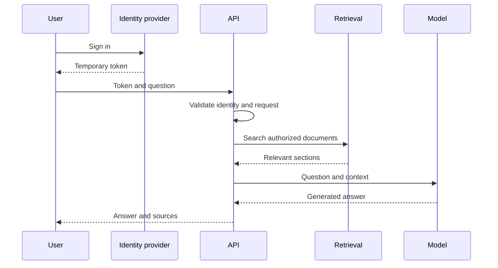

# aws-ai-infrastructure-platform

Production-style AI infrastructure using AWS, Terraform, EKS, NVIDIA GPUs, secure CI/CD, monitoring and cost controls.

## System Design

### 1. Project goal

Build a secure, observable and cost-controlled platform that answers user questions using information retrieved from approved documents.

### 2. Example use case

A user asks:

> What is the company password policy?

The system searches approved security documents, finds the relevant section, sends that section with the question to the model, and returns an answer with the source document.

### 3. Functional requirements

The system must:

1. Authenticate application users.
2. Validate incoming questions.
3. Check which documents the user may access.
4. Find relevant document sections.
5. Send the question and context to the model.
6. Return the answer and sources.
7. Record logs, metrics and errors.
8. Provide health and readiness endpoints.

### 4. Non-functional requirements

| Area | Requirement |
|---|---|
| Security | Temporary credentials, least privilege and encryption |
| Availability | Multiple API replicas and health checks |
| Scalability | API and model scale independently |
| Performance | Configure model timeouts and resource limits |
| Observability | Central logs, metrics and alerts |
| Cost | GPU nodes remain at zero when unused |
| Recovery | Recreate infrastructure from Git and Terraform |
| Privacy | Use only public or synthetic lab documents |

### 5. Request flow



### 6. Component responsibilities

| Component | Responsibility |
|---|---|
| API | Authentication, validation and workflow control |
| Retrieval service | Search relevant authorized content |
| Vector database | Store searchable document representations |
| Model service | Generate an answer from the supplied context |
| S3 | Store encrypted source documents |
| Kubernetes | Schedule, restart and scale containers |
| Terraform | Create and destroy AWS infrastructure |
| GitHub Actions | Test, scan, build and deploy |
| Monitoring | Detect availability, performance and GPU problems |

### 7. API design

| Method | Endpoint | Authentication | Purpose |
|---|---|---:|---|
| GET | `/health` | Internal/public health check | Process health |
| GET | `/ready` | Internal | Dependency readiness |
| POST | `/ask` | Required later | Submit a question |
| POST | `/documents` | Administrator later | Upload a document |
| GET | `/metrics` | Internal only | Operational metrics |

### 8. Availability design

- Run at least two API replicas.
- Use readiness probes to remove unhealthy pods from service.
- Use liveness probes to restart failed containers.
- Use a Kubernetes Service as the stable address.
- Keep the model independent from the API.
- Return HTTP 503 if the model is temporarily unavailable.

### 9. Scaling design

```text
API service:
CPU workload -> multiple inexpensive replicas

Model service:
GPU workload -> fewer expensive replicas
```

API and model services must scale independently.

### 10. Security design

- Application users authenticate with temporary tokens.
- Administrators use IAM Identity Center.
- GitHub Actions uses OIDC instead of permanent AWS keys.
- Pods use dedicated workload identities.
- Containers run as non-root.
- S3 public access is blocked.
- Data and secrets are encrypted.
- Network policies restrict API-to-model traffic.
- Container images and dependencies are scanned.

### 11. Configuration design

Configuration is supplied through environment variables:

```text
APP_ENV=local
LOG_LEVEL=INFO
MODEL_BASE_URL=http://model-service:8001
MODEL_TIMEOUT_SECONDS=30
```

Secrets are stored separately:

```text
Local development -> ignored .env file
AWS environment   -> AWS Secrets Manager
```

### 12. Failure scenarios

| Failure | Expected response |
|---|---|
| API pod fails | Deployment creates a replacement |
| Readiness fails | Service stops sending traffic to that pod |
| Model unavailable | API returns controlled HTTP 503 |
| Invalid question | API returns HTTP 422 |
| Missing authentication | API returns HTTP 401 |
| Insufficient permission | API returns HTTP 403 |
| GPU capacity unavailable | Model pod remains pending and alert is generated |

### 13. Implementation phases

1. Local FastAPI and automated tests — completed.
2. Secure Docker image — completed.
3. Local Kubernetes Deployment and Service — completed.
4. GitHub continuous integration — completed.
5. Mock inference service- completed..
6. Document retrieval and vector storage.
7. AWS foundation with Terraform.
8. Amazon EKS CPU deployment.
9. Temporary NVIDIA GPU inference.
10. Monitoring and security validation.
11. Destruction and leftover-resource check.

## Project progress

The API and mock model communicate successfully in Docker and local
Kubernetes. GitHub Actions now tests both applications separately and
verifies a real request between their containers.

**Progress: 13 milestones completed, 1 in progress, 8 planned.**

| # | Milestone | Status | Result |
|---|---|---|---|
| 1 | Create project structure and Git branches | ✅ Done | Application, infrastructure, Kubernetes and documentation folders created |
| 2 | Build the FastAPI application | ✅ Done | `/health`, `/ready` and `/ask` endpoints implemented |
| 3 | Validate incoming questions | ✅ Done | Missing, empty and incorrectly typed questions are rejected |
| 4 | Package the API with Docker | ✅ Done | API image built with a non-root application user |
| 5 | Deploy the API to local Kubernetes | ✅ Done | Two API replicas, internal Service, probes and resource limits configured |
| 6 | Create GitHub Actions CI | ✅ Done | Automated dependency checks, application tests and API image build |
| 7 | Add API container validation | ✅ Done | Image vulnerability scanning and container health smoke test added |
| 8 | Build the mock model service | ✅ Done | Separate `/health` and `/generate` endpoints return predictable responses |
| 9 | Connect the API to the mock service | ✅ Done | API forwards questions over HTTP and handles connection failures |
| 10 | Test both applications | ✅ Done | Eight API tests and seven mock tests pass; each module has its own CI step |
| 11 | Containerize and connect both services | ✅ Done | API and mock containers communicate over a Docker network |
| 12 | Connect both services in Kubernetes | ✅ Done | Two API pods and one mock pod deployed; `/ask` returns HTTP 200 with `mock-model-v1` |
| 13 | Update project documentation | 🟡 In progress | Update README, architecture diagrams, configuration mappings and troubleshooting notes |
| 14 | Automate two-container integration testing | ✅ Done | CI builds and scans both images, checks container health and verifies a real API-to-mock request |
| 15 | Add document retrieval | ⬜ Planned | Ingest documents, create embeddings and retrieve relevant context |
| 16 | Connect a real AI model | ⬜ Planned | Replace predefined mock responses with generated answers |
| 17 | Add authentication and access controls | ⬜ Planned | Validate user identity and restrict document access |
| 18 | Create AWS infrastructure with Terraform | ⬜ Planned | Build reproducible cloud networking, identities and supporting services |
| 19 | Deploy the platform to Amazon EKS | ⬜ Planned | Run the application on AWS Kubernetes |
| 20 | Add NVIDIA GPU inference | ⬜ Planned | Run and validate GPU-backed model serving |
| 21 | Add monitoring and operational validation | ⬜ Planned | Collect metrics, build dashboards and test alerts and recovery |
| 22 | Validate cloud cost controls and teardown | ⬜ Planned | Destroy lab infrastructure and check for leftover chargeable resources |

### Automated validation

| Check | What it verifies |
|---|---|
| API tests — 8 tests | API health, readiness response, question validation, response handling and unavailable-model behavior |
| Mock model tests — 7 tests | Mock health, predictable responses, whitespace handling and invalid prompts |
| API image scan | Known vulnerabilities in operating-system packages and application libraries |
| Mock image scan | Known vulnerabilities in operating-system packages and application libraries |
| Mock container smoke test | The packaged mock starts and responds to `/health` |
| API container smoke test | The packaged API starts and responds to `/health` |
| Container integration test | `/ask` reaches the mock's `/generate` endpoint and returns the expected question, answer and model name |

### Vulnerability scanning policy

- Report HIGH and CRITICAL findings for both images, including findings without fixes.
- Fail the pipeline when HIGH or CRITICAL findings have available fixes.
- A passing scan does not mean an image has no vulnerabilities.

### Current limitations

- Answers come from a mock service; no real AI model is connected.
- Document retrieval and user authentication are not implemented.
- The API readiness endpoint does not yet check the model dependency.
- Application tests run in memory; API tests simulate outgoing model requests.
- The separate container integration test uses real HTTP communication.
- Kubernetes integration has been verified manually; automated Kubernetes testing is planned.
- AWS and GPU deployment remain planned.

### Configuration issue resolved

The API initially returned HTTP 503 because the Deployment defined
`MODEL_SERVICE_URL`, while the Python application read `MODEL_BASE_URL`.

Changing the Deployment variable to
`MODEL_BASE_URL=http://mock-model:8002` restored communication.
The corrected Deployment was applied without rebuilding the image.
