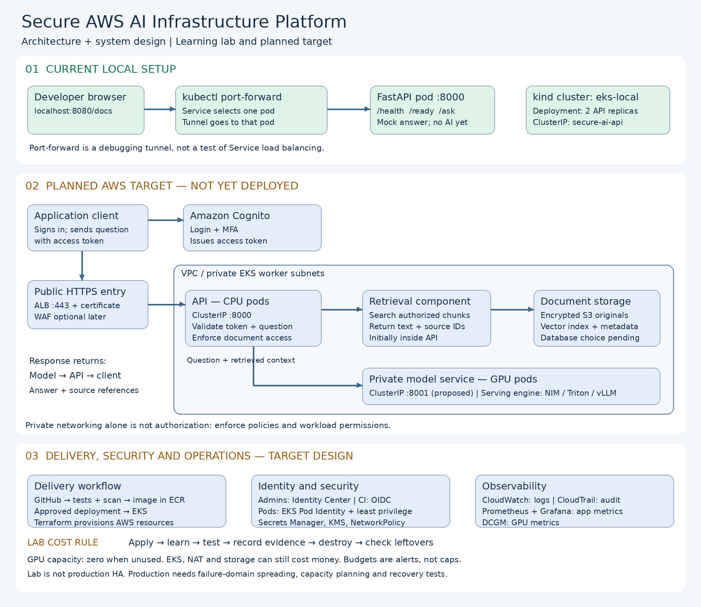
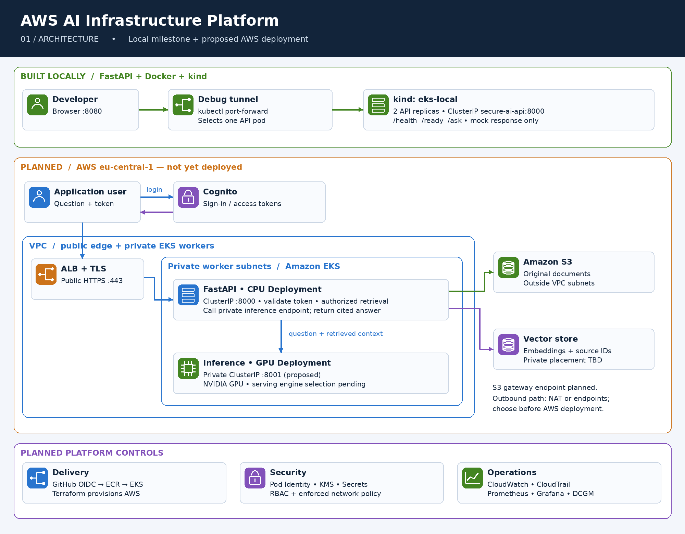
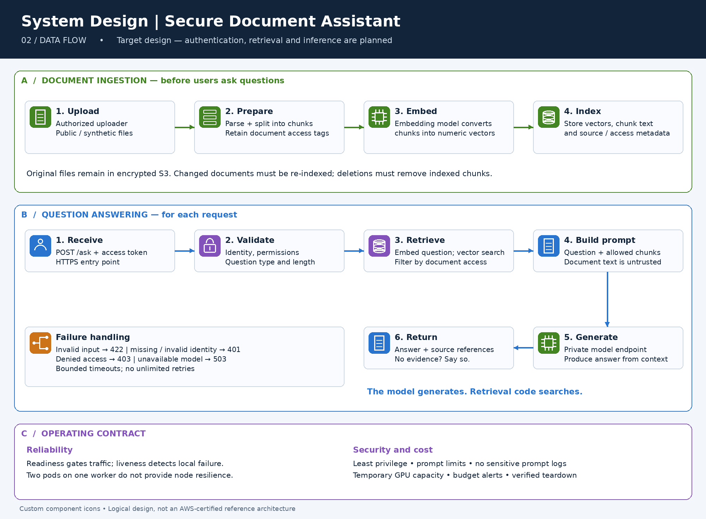
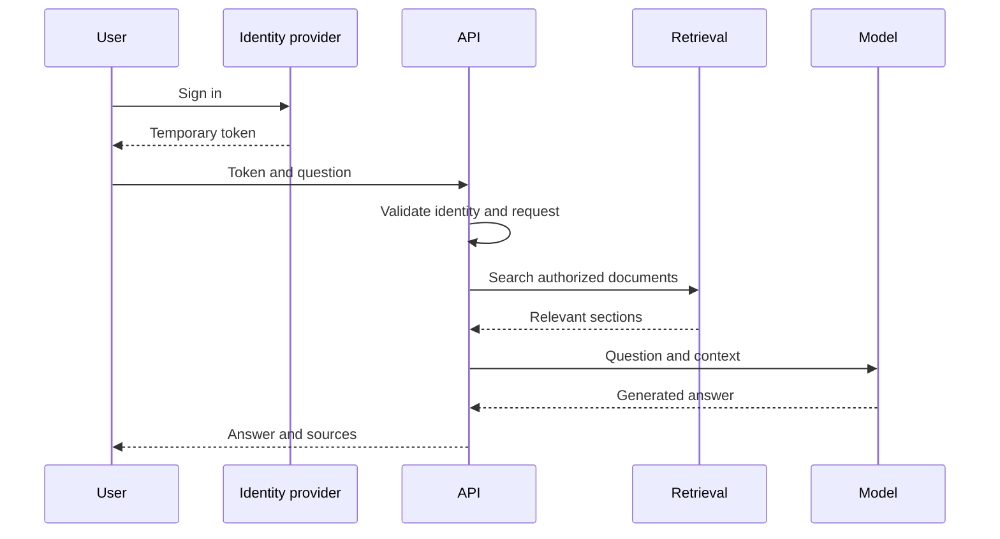

# aws-ai-infrastructure-platform

Production-style AI infrastructure using AWS, Terraform, EKS, NVIDIA GPUs, secure CI/CD, monitoring and cost controls.

## Architecture overview

This platform combines a FastAPI application, a model service, Kubernetes orchestration, and AWS-native infrastructure patterns to provide secure, observable AI question answering for approved document sets.





## System Design

### 1. Project goal

Build a secure, observable and cost-controlled platform that answers user questions using information retrieved from approved documents.

### 2. Example use case

A user asks:

> What is the company password policy?

The system searches approved security documents, finds the relevant section, sends that section with the question to the model, and returns an answer with the source document.

### 3. Functional requirements

The system must:

1. Authenticate application users.
2. Validate incoming questions.
3. Check which documents the user may access.
4. Find relevant document sections.
5. Send the question and context to the model.
6. Return the answer and sources.
7. Record logs, metrics and errors.
8. Provide health and readiness endpoints.

### 4. Non-functional requirements

| Area | Requirement |
|---|---|
| Security | Temporary credentials, least privilege and encryption |
| Availability | Multiple API replicas and health checks |
| Scalability | API and model scale independently |
| Performance | Configure model timeouts and resource limits |
| Observability | Central logs, metrics and alerts |
| Cost | GPU nodes remain at zero when unused |
| Recovery | Recreate infrastructure from Git and Terraform |
| Privacy | Use only public or synthetic lab documents |

### 5. Request flow


```mermaid
sequenceDiagram
    participant U as User
    participant I as Identity provider
    participant A as API
    participant R as Retrieval
    participant M as Model

    U->>I: Sign in
    I-->>U: Temporary token
    U->>A: Token and question
    A->>A: Validate identity and request
    A->>R: Search authorized documents
    R-->>A: Relevant sections
    A->>M: Question and context
    M-->>A: Generated answer
    A-->>U: Answer and sources
```
### 13. Implementation phases

1. Local FastAPI application and automated tests — ✅ Completed.
2. Secure Docker images and vulnerability scanning — ✅ Completed.
3. Local Kubernetes Deployments and Services — ✅ Completed.
4. GitHub application CI and container integration testing — ✅ Completed.
5. Mock inference service and API communication — ✅ Completed.
6. Document loading, change detection and persistent ingestion state — ✅ Completed.
7. Document chunking, embeddings, retrieval and vector storage — ⬜ Planned.
8. AWS foundation with Terraform — 🟡 In progress.
9. Terraform pull-request planning and AWS spending reports — 🟡 In progress.
10. Amazon EKS CPU deployment — ⬜ Planned.
11. Real model integration and temporary NVIDIA GPU inference — ⬜ Planned.
12. Authentication, monitoring and operational security validation — ⬜ Planned.
13. Infrastructure teardown and leftover-resource verification — ⬜ Planned.

## Project progress

The API and mock model communicate successfully in Docker and local
Kubernetes. Application CI tests both services and verifies a real
API-to-model request.

Document ingestion now loads sample hospital documents, detects changes
and saves a local JSON snapshot between runs. All 15 ingestion tests
passed locally and in GitHub Actions. Retrieval and real AI answers
are not implemented yet.

AWS Terraform state storage and the encrypted document bucket have been
created. The networking module passes local Terraform validation.
Network deployment and the revised pull-request planning workflow are
still being verified.

**Progress: 20 milestones completed, 4 in progress, 8 planned.**

| # | Milestone | Status | Result |
|---|---|---|---|
| 1 | Create project structure and Git branches | ✅ Done | Application, infrastructure, Kubernetes and documentation folders created |
| 2 | Build the FastAPI application | ✅ Done | `/health`, `/ready` and `/ask` endpoints implemented |
| 3 | Validate incoming questions | ✅ Done | Missing, empty and incorrectly typed questions are rejected |
| 4 | Package the API with Docker | ✅ Done | API image runs with a non-root application user |
| 5 | Deploy the API to local Kubernetes | ✅ Done | Two replicas, internal Service, health probes and resource limits configured |
| 6 | Create GitHub Actions application CI | ✅ Done | Dependency checks, application tests and Docker builds automated |
| 7 | Add image scanning and container validation | ✅ Done | Vulnerability scans and container health checks added |
| 8 | Build the mock model service | ✅ Done | Separate `/health` and `/generate` endpoints return predictable responses |
| 9 | Connect the API to the mock service | ✅ Done | API forwards questions over HTTP and handles model-service failures |
| 10 | Test both applications | ✅ Done | API and mock-service tests run in separate CI steps |
| 11 | Connect both services in Docker | ✅ Done | API and mock containers communicate over a shared Docker network |
| 12 | Connect both services in local Kubernetes | ✅ Done | Two API pods and one mock pod run on the worker node; `/ask` returns HTTP 200 |
| 13 | Automate container integration testing | ✅ Done | CI verifies a real API-to-mock request and the expected response |
| 14 | Create sample hospital documents | ✅ Done | Synthetic application overview, login-failure runbook and recovery checklist added |
| 15 | Implement the document loader | ✅ Done | Markdown documents load with their text and source filenames |
| 16 | Implement document change detection | ✅ Done | Snapshots identify new, changed, unchanged and removed documents |
| 17 | Add persistent ingestion state and a runnable command | ✅ Done | Local JSON state remembers documents between runs; invalid state and failed saves are tested |
| 18 | Add ingestion tests to CI | ✅ Done | All 15 loader, change-detection, state and command tests passed locally and in CI |
| 19 | Bootstrap remote Terraform state | ✅ Done | Dedicated S3 state bucket created with versioning, encryption and public-access blocking; dev uses a separate state key and locking |
| 20 | Configure AWS access and manual Terraform apply | ✅ Done | Separate planning and apply roles use temporary GitHub credentials; a manually requested apply completed successfully |
| 21 | Create encrypted AWS document storage | ✅ Done | Document bucket deployed with public-access blocking, versioning and customer-managed KMS encryption |
| 22 | Build and deploy the AWS network module | 🟡 In progress | VPC, two private subnets, route tables and default security-group restrictions configured; local validation passed; deployment verification pending |
| 23 | Complete pre-merge Terraform planning | 🟡 In progress | Workflow configured for validation, security scans and PR planning; latest end-to-end run still needs confirmation |
| 24 | Integrate recorded AWS spending reports | 🟡 In progress | Local Cost Explorer query succeeded; pipeline report added and Infracost removed; CI verification pending |
| 25 | Maintain project documentation | 🟡 In progress | README, ingestion guide, networking mappings and pipeline instructions updated as implementation progresses |
| 26 | Add chunking, embeddings and vector retrieval | ⬜ Planned | Split documents into searchable sections and retrieve relevant evidence with source references |
| 27 | Connect a real AI model | ⬜ Planned | Send the question and retrieved evidence to a model and return a grounded answer |
| 28 | Add authentication and document access controls | ⬜ Planned | Validate user identity and restrict retrieval to permitted documents |
| 29 | Connect ingestion to AWS document storage | ⬜ Planned | Read approved documents from S3 and process updates through a separate ingestion workflow |
| 30 | Deploy the platform to Amazon EKS | ⬜ Planned | Run the API and supporting services on CPU worker nodes |
| 31 | Add temporary NVIDIA GPU inference | ⬜ Planned | Deploy GPU-backed model serving, test performance and remove GPU resources after testing |
| 32 | Validate operations, cost controls and teardown | ⬜ Planned | Add metrics and alerts, test recovery, review spending and verify removal of chargeable lab resources |

### 6. Component responsibilities

| Component | Responsibility |
|---|---|
| API | Authentication, validation and workflow control |
| Retrieval service | Search relevant authorized content |
| Vector database | Store searchable document representations |
| Model service | Generate an answer from the supplied context |
| S3 | Store encrypted source documents |
| Kubernetes | Schedule, restart and scale containers |
| Terraform | Create and destroy AWS infrastructure |
| GitHub Actions | Test, scan, build and deploy |
| Monitoring | Detect availability, performance and GPU problems |

### 7. API design

| Method | Endpoint | Authentication | Purpose |
|---|---|---:|---|
| GET | `/health` | Internal/public health check | Process health |
| GET | `/ready` | Internal | Dependency readiness |
| POST | `/ask` | Required later | Submit a question |
| POST | `/documents` | Administrator later | Upload a document |
| GET | `/metrics` | Internal only | Operational metrics |

### 8. Availability design

- Run at least two API replicas.
- Use readiness probes to remove unhealthy pods from service.
- Use liveness probes to restart failed containers.
- Use a Kubernetes Service as the stable address.
- Keep the model independent from the API.
- Return HTTP 503 if the model is temporarily unavailable.

### 9. Scaling design

```text
API service:
CPU workload -> multiple inexpensive replicas

Model service:
GPU workload -> fewer expensive replicas
```

API and model services must scale independently.

### 10. Security design

- Application users authenticate with temporary tokens.
- Administrators use IAM Identity Center.
- GitHub Actions uses OIDC instead of permanent AWS keys.
- Pods use dedicated workload identities.
- Containers run as non-root.
- S3 public access is blocked.
- Data and secrets are encrypted.
- Network policies restrict API-to-model traffic.
- Container images and dependencies are scanned.

### 11. Configuration design

Configuration is supplied through environment variables:

```text
APP_ENV=local
LOG_LEVEL=INFO
MODEL_BASE_URL=http://model-service:8001
MODEL_TIMEOUT_SECONDS=30
```

Secrets are stored separately:

```text
Local development -> ignored .env file
AWS environment   -> AWS Secrets Manager
```

### 12. Failure scenarios

| Failure | Expected response |
|---|---|
| API pod fails | Deployment creates a replacement |
| Readiness fails | Service stops sending traffic to that pod |
| Model unavailable | API returns controlled HTTP 503 |
| Invalid question | API returns HTTP 422 |
| Missing authentication | API returns HTTP 401 |
| Insufficient permission | API returns HTTP 403 |
| GPU capacity unavailable | Model pod remains pending and alert is generated |


### Automated validation

| Check | What it verifies |
|---|---|
| API tests — 8 tests | API health, readiness response, question validation, response handling and unavailable-model behavior |
| Mock model tests — 7 tests | Mock health, predictable responses, whitespace handling and invalid prompts |
| API image scan | Known vulnerabilities in operating-system packages and application libraries |
| Mock image scan | Known vulnerabilities in operating-system packages and application libraries |
| Mock container smoke test | The packaged mock starts and responds to `/health` |
| API container smoke test | The packaged API starts and responds to `/health` |
| Container integration test | `/ask` reaches the mock's `/generate` endpoint and returns the expected question, answer and model name |

### Vulnerability scanning policy

- Report HIGH and CRITICAL findings for both images, including findings without fixes.
- Fail the pipeline when HIGH or CRITICAL findings have available fixes.
- A passing scan does not mean an image has no vulnerabilities.

### Current limitations

- Answers come from a mock service; no real AI model is connected.
- Document retrieval and user authentication are not implemented.
- The API readiness endpoint does not yet check the model dependency.
- Application tests run in memory; API tests simulate outgoing model requests.
- The separate container integration test uses real HTTP communication.
- Kubernetes integration has been verified manually; automated Kubernetes testing is planned.
- AWS and GPU deployment remain planned.

### Configuration issue resolved

The API initially returned HTTP 503 because the Deployment defined
`MODEL_SERVICE_URL`, while the Python application read `MODEL_BASE_URL`.

Changing the Deployment variable to
`MODEL_BASE_URL=http://mock-model:8002` restored communication.
The corrected Deployment was applied without rebuilding the image.
