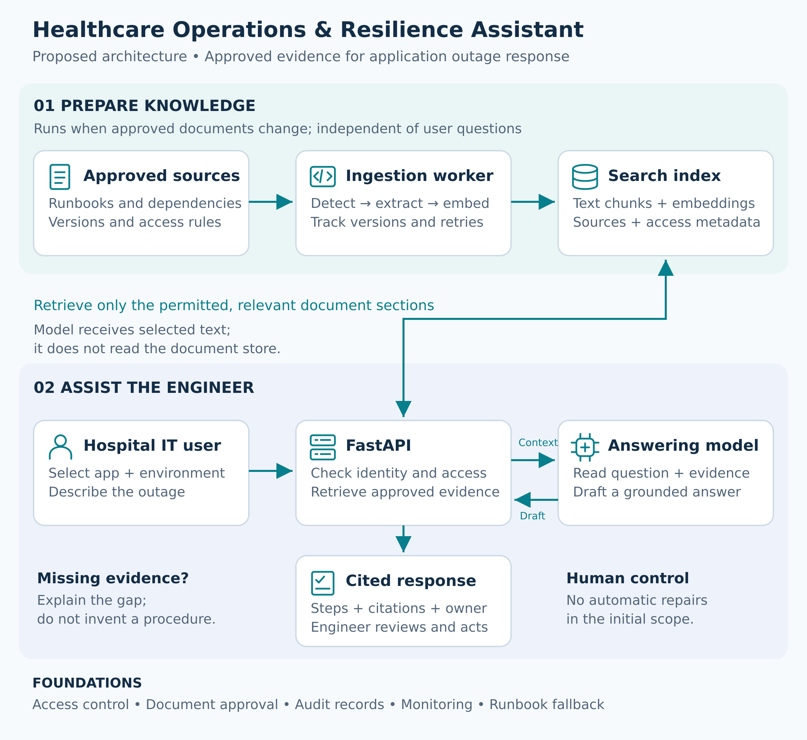

# Healthcare Operations & Resilience Assistant

Project purpose and proposed architecture

Helps hospital IT teams answer: “This application is unavailable—what approved procedure applies, who should respond, and how do we verify recovery?”

## 1 Project goal

Provide source-linked guidance from approved application documentation during an outage. The engineer selects the hospital, application and environment, describes the symptom, and receives relevant checks, escalation ownership and recovery criteria.

- Primary users: hospital IT operations, application support and incident coordinators.

- Primary benefit: less time searching for the right procedure and clearer evidence for the next action.

- Initial boundary: guidance for human review; no autonomous repairs or clinical decisions.

## 2 The operational problem

An application depends on login services, application servers, databases, networking and external interfaces. Its operating knowledge may be spread across document systems, configuration references and incident records. During an outage, engineers need the correct version for the affected environment.

## 3 Example outage

Fictional scenario: at 07:00, Hospital A staff cannot sign in to CareRoster, a staff-scheduling application. The engineer asks: “CareRoster production reports sign-in unavailable. What should we check and who owns the escalation?”

| Current difficulty | What the assistant provides |
| --- | --- |
| Scattered or similar-looking runbooks | Relevant approved passages for CareRoster production |
| Unclear infrastructure dependencies | Documented login, application and database relationships |
| Uncertain ownership and recovery checks | Named support role, escalation criteria and verification steps |

The assistant does not know the live cause unless connected to monitoring. Its first role is to identify the applicable documented procedure.

## 4 Project architecture

Two independent workflows share a search index: ingestion prepares approved knowledge; FastAPI retrieves that knowledge when an engineer asks a question.

Diagram scope: proposed target architecture. The existing mock model demonstrates connectivity; a real answering model, document retrieval and access controls remain planned.

## What the components do

- Ingestion worker: processes new or changed documents and records successful versions.

- FastAPI: checks access, retrieves evidence and sends the question plus context to the model.

- Answering model: drafts from the supplied passages; it does not need direct access to the document store.

- Response checks: validate structure and source identifiers. These checks alone do not prove every statement is supported; answer evaluation and human review remain necessary.

## 5 Data sources and required knowledge

The core dataset is operational documentation. Patient records and medical training datasets are not required for this use case.

| Knowledge type | Information needed |
| --- | --- |
| Application overview | Purpose, service owner, users and operational importance |
| Dependency and configuration reference | Login, network, database and interface mappings; environment-specific settings without secrets |
| Troubleshooting runbooks | Symptoms, approved checks, decision points and action permissions |
| Escalation and downtime procedures | Responsible teams, escalation conditions and approved operational fallback |
| Recovery checklist and reviewed incidents | Functional verification steps and lessons from past incidents |

## Public demonstration data

- Create a fictional Hospital A and CareRoster knowledge pack of about ten short documents.

- Cover three scenarios: login unavailable, application unavailable and database connection failure.

- Include approved and superseded versions plus missing-evidence questions to test retrieval behavior.

- Use public healthcare guidance as background; check reuse terms before redistributing source documents.

## Authorized hospital deployment

Connect approved hospital document repositories or private object storage. Each document needs a stable ID, hospital, application, environment, owner, version, approval state, review date and access rules. Local procedures must be supplied and maintained by the organization.

## Reference sources

SAFER Guides — contingency planning and system management:
https://healthit.gov/clinical-quality-and-safety/safer-guides

NHS England Digital — disaster recovery and business continuity:
https://digital.nhs.uk/services/cloud-centre-of-excellence/infrastructure-centre-of-excellence/standards-policy-and-architecture/infrastructure-hosting-standards-for-the-nhs/disaster-recovery-and-business-continuity

These sources offer general principles. They do not define a particular hospital’s configuration or approved repair procedure.

## 6 Incident assistance workflow

1. Engineer signs in and selects the authorized hospital, application and environment.

2. Engineer describes the symptom. The service asks for clarification when essential context is missing.

3. Retrieval filters by access and document scope, then finds relevant approved passages.

4. FastAPI sends the question and retrieved passages to the answering model.

5. The assistant returns documented checks, source references, escalation ownership and recovery criteria.

6. The engineer reviews the evidence and performs authorized checks using existing tools.

7. Missing, conflicting or outdated evidence is reported; the assistant does not invent a procedure.

## 7 Document ingestion and updates

An approved upload or scheduled check starts ingestion independently from questions. The worker compares source versions or fingerprints, skips unchanged documents, extracts and embeds changed content, and publishes successful updates. Deletions and permission changes also need synchronization.

A new document does not require an API image rebuild. GitHub manages code and configuration; production documents belong in an approved content repository. Failed processing is recorded and retried without creating duplicate chunks.

## 8 Success measures and delivery status

| Measure | Demonstration |
| --- | --- |
| Find the correct procedure | Compare manual search time with assistant-assisted search |
| Evidence and scope accuracy | Check expected sources, environment filters and unsupported answers |
| Freshness and access | Update or withdraw a document; test access across hospitals |
| Operational reliability | Test model unavailability, ingestion retries and direct runbook fallback |

Completed foundation: FastAPI, mock model service, Docker packaging, local Kubernetes connectivity, automated tests and container integration testing. Planned next: synthetic knowledge pack, ingestion, retrieval, real model serving, access controls and answer evaluation.

The final demonstration succeeds when a newly approved document becomes searchable without redeploying FastAPI, and an engineer receives a relevant, source-linked procedure while retaining control over operational actions.
