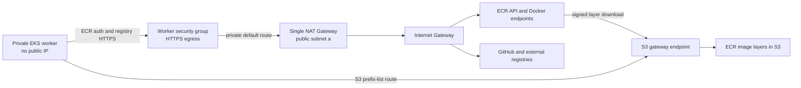
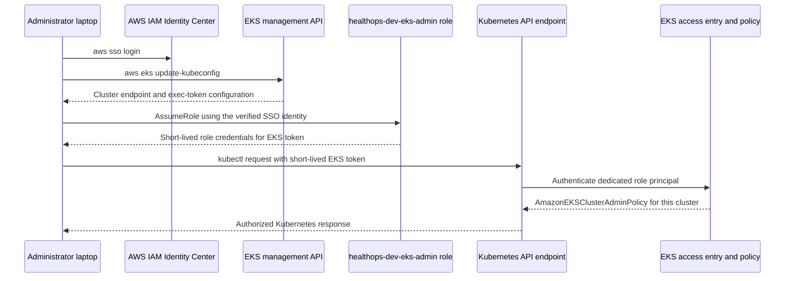

# HealthOps worker connectivity and administrator access

## Current state and scope

The repository has a dev VPC (`10.40.0.0/16`), two private subnets and their
route tables, VPC DNS resolution and hostnames, a locked-down default security
group, VPC Flow Logs, encrypted document storage and the two ECR repositories.
Read-only AWS checks in `eu-central-1` confirmed the VPC and its two private
subnets (`10.40.16.0/20` in `eu-central-1a`; `10.40.32.0/20` in
`eu-central-1b`), both with public-IP assignment disabled. DNS support and
hostnames are enabled. The current private routes are VPC-local only. The
proposed public `/24` ranges are not currently allocated to subnets in this VPC.
The ECR repositories and published images are already in place.

The initial read-only inventory predates the networking deployment. The NAT,
S3 gateway endpoint, private routes and prepared security groups now exist, and
the seven required standalone outbound rules have been checked in AWS. The
`ai-platform-dev` EKS module and bootstrap IAM changes are now prepared, but
the EKS cluster, node group and add-ons remain **not deployed**. See
[eks-deployment.md](eks-deployment.md) for the current plan and deployment
procedure. No application endpoint (Load Balancer, ingress or public
application URL) is part of this milestone.

| Resource or configuration | Status after this change |
|---|---|
| Existing VPC, private subnets, route tables and DNS | Live-checked in `eu-central-1`; both private subnets have public-IP assignment disabled and local-only routes |
| Flow Logs, encrypted document bucket and ECR | Tracked by the existing dev deployment/state; unchanged by this connectivity plan |
| Public subnets, Internet Gateway, NAT, routes and S3 gateway endpoint | Existing; already deployed |
| Additional EKS control-plane and worker security groups and seven outbound rules | Existing; standalone rule ownership retained and rules checked in AWS |
| EKS cluster, workers and core add-ons | Prepared in dev Terraform; not deployed |
| Cluster, worker and VPC CNI roles and workflow policies | Prepared in bootstrap Terraform; apply and verify before dev planning |
| Administrator CIDR and IAM role inputs | Required by dev Terraform; confirm current public IPv4 `/32` before every cluster create/update |
| Dedicated `healthops-dev-eks-admin` role | Exists in bootstrap state and has the previously verified SSO trust |
| EKS administrator access entry and cluster-admin association | Wired to the EKS module; not deployed until the cluster is created |
| Public application endpoint | Not created; separate application-deployment milestone |

## Image-pull workflow

Example: **I deploy the HealthOps API; a private worker downloads the image from
ECR and starts the container.**



The private worker has no public address. HTTPS egress leaves through the NAT
gateway for ECR API/registry calls, AWS APIs, GitHub and external registries.
The S3 gateway endpoint gives the private subnets a direct route for S3 traffic,
including ECR image-layer downloads; that traffic does not traverse the NAT.

The bootstrap module prepares a dedicated worker role with
`AmazonEC2ContainerRegistryPullOnly` and `AmazonEKSWorkerNodePolicy`. VPC CNI
permissions are on a separate Pod Identity role. Do not attach ECR pull
permissions to the publisher role or Terraform execution role. These roles
must be applied through bootstrap before deploying dev EKS.

## Administrator `kubectl` workflow



The EKS **management API** (`eks.eu-central-1.amazonaws.com`) manages AWS
cluster objects. The **Kubernetes API endpoint** is the cluster-specific
endpoint used by `kubectl`. An EKS interface VPC endpoint gives access to the
management API only; it does not route `kubectl` to the Kubernetes API endpoint.
The application endpoint is different again and is not part of this change.

When EKS is added, configure both private and public Kubernetes API access. The
public endpoint must use only the explicitly supplied administrator IPv4 `/32`;
there is no `0.0.0.0/0` default. The private endpoint serves in-VPC nodes and,
later, VPN-connected administrators. EKS access entries authenticate the IAM
role; `AmazonEKSClusterAdminPolicy` grants cluster-wide Kubernetes administrator
permissions to that role.

## Routes, permissions and security rules

| Item | Direction / scope | Purpose |
|---|---|---|
| VPC local route | Within `10.40.0.0/16` | Private communication between VPC resources |
| Public subnet `0.0.0.0/0` route | Public route table → Internet Gateway | Gives the NAT Gateway's public subnet internet routing; no worker receives a public IP |
| Private subnet `0.0.0.0/0` route | Each private route table → the single NAT Gateway | Enables outbound HTTPS without assigning worker public addresses |
| S3 managed prefix-list route | Private route tables → S3 gateway endpoint | Sends S3/ECR image-layer traffic directly to S3 rather than via NAT |
| VPC DNS settings | VPC resolver | DNS support and DNS hostnames are already enabled |
| Worker security group ingress | From worker group, all protocols | Required node-to-node and pod networking; no SSH rule |
| Worker security group ingress | From additional EKS control-plane group, TCP 10250 and TCP 443 | Control-plane access to kubelet and HTTPS webhooks; add explicit webhook ports only when required |
| Worker security group egress | To control-plane group, TCP 443 | Node access to the Kubernetes API |
| Worker security group egress | To `0.0.0.0/0`, TCP 443; documented Trivy 0.70 exception `AWS-0104` | Required for ECR, GitHub and external registries with changing public IPs; private subnet routing still forces outbound traffic through NAT, and no internet ingress is allowed |
| Worker security group egress | To VPC CIDR, TCP/UDP 53 | VPC and public DNS lookups |
| Control-plane security group ingress | From worker group, TCP 443 | Worker access to the Kubernetes API |
| Control-plane security group egress | To worker group, TCP 10250 and TCP 443 | Control-plane access to kubelet and HTTPS webhooks; add explicit webhook ports only when required |
| Worker IAM role (prepared in bootstrap) | `AmazonEC2ContainerRegistryPullOnly` and `AmazonEKSWorkerNodePolicy` | Pull authorization for private ECR; separate from Terraform and image publishing |
| Administrator IAM role | EKS access entry plus `AmazonEKSClusterAdminPolicy` | Kubernetes authorization after AWS IAM authentication |
| Public Kubernetes endpoint (proposed) | Exactly the freshly confirmed administrator IPv4 `/32` | Restricts internet-side `kubectl`; never use `0.0.0.0/0` |
| Application endpoint (future) | Separate service/load-balancer policy | Serves application users; not the Kubernetes API allowlist |

The default VPC security group remains restricted and is not reused for workers.
The prepared additional control-plane SG attaches to the cluster interfaces.
The managed-node-group launch template attaches only the prepared worker SG;
it does not attach the AWS-managed cluster SG to workers. Explicit ingress and
egress rules between the prepared groups provide the API, kubelet, webhook and
node paths. Checkov flags these unattached groups before EKS is deployed; the
narrow inline exceptions apply only until the EKS milestone attaches them.
Remove those exceptions after association. The control-plane
rules use TCP 10250 for kubelet rather than a broad range that also includes
remote-desktop ports. Add any workload webhook port explicitly when that
workload is introduced. Trivy flags unrestricted HTTPS egress as critical; the
inline exception is limited to this worker rule and documents the lab requirement.
Before production, replace it with a controlled egress firewall or proxy and
explicit destination policy, then remove the exception. NAT provides address
translation, not destination filtering.

## Terraform inputs and EKS integration

The dev root requires an administrator object for the EKS cluster. Supply
both values, and confirm the public address is current before planning an EKS
create or update. Terraform validation requires a real IPv4 `/32` other than
`0.0.0.0/32`, and an IAM role ARN in the same 12-digit account as the cluster.
There is no default public CIDR or role.

Example only—replace both placeholders with values you explicitly choose; do not
commit personal IP details:

```hcl
eks_administrator = {
  public_ipv4_cidr = "195.14.217.35/32"
  iam_role_arn     = "arn:aws:iam::429496640190:role/healthops-dev-eks-admin"
}
```

The `195.14.217.35` value was supplied earlier and is historical; do not
assume it is still current. The role ARN is now an existing bootstrap-managed
role. Bootstrap refresh confirmed the role is present, and its trust is
configured for the verified SSO role:
`arn:aws:iam::429496640190:role/aws-reserved/sso.amazonaws.com/eu-central-1/AWSReservedSSO_AdministratorAccess_4af4e9b42a20d275`.
That SSO role has the AWS-managed `AdministratorAccess` policy, and the
previous IAM simulation confirmed it can call `sts:AssumeRole`. The dedicated
role has no broad AWS permissions; Kubernetes administrator authorization
comes from the cluster-scoped EKS access policy association.

The existing `infrastructure/terraform/environments/dev/variables.tf` defines
and validates this object. The supplied values are in the ignored local
`infrastructure/terraform/environments/dev/terraform.tfvars`; Terraform's
`.gitignore` excludes `*.tfvars`. The file is local-only and is not included in
GitHub Actions.

Set or update both repository Actions variables in the GitHub website; the
workflows do not upload ignored local tfvars. Verify the CIDR variable again
immediately before an EKS deployment. Open the repository, then go to **Settings → Secrets and variables →
Actions → Variables → New repository variable**. Add:

| Name | Value |
|---|---|
| `EKS_ADMIN_PUBLIC_IPV4_CIDR` | Current administrator IPv4 ``; refresh before deploy |
| `EKS_ADMIN_IAM_ROLE_ARN` | `arn:aws:iam::429496640190:role/healthops-dev-eks-admin` |

These are configuration values, not AWS credentials. The workflows require a complete pair and pass it through Terraform's input
validation. The manual apply workflow also requires the current CIDR to be
confirmed when the plan creates or changes EKS.
GitHub CLI (`gh`) is optional; it is not required to configure repository
variables.

The EKS module now implements the endpoint settings, access entry, IAM role
references, managed node group and add-ons. The launch template attaches only
the prepared worker SG; it does not rely on EKS automatically attaching its
managed cluster SG to workers. Review the security-group communication table
in [eks-deployment.md](eks-deployment.md). EKS itself remains undeployed until
the bootstrap IAM changes and a reviewed dev apply are explicitly approved.

## Deploy and verify networking

The dev apply role needs the new network policy first. From the repository root,
review the separate bootstrap state with the existing bootstrap procedure; the
current read-only plan is three additions (the network apply policy and
attachment, plus `healthops-dev-eks-admin`) and one in-place policy update,
with no deletions. Regenerate it before acting:

```powershell
aws sso login --profile ai-lab-admin
$env:AWS_PROFILE = "ai-lab-admin"
terraform -chdir=infrastructure/terraform/bootstrap init -lockfile=readonly
terraform -chdir=infrastructure/terraform/bootstrap plan
```

Apply bootstrap only after reviewing and approving its plan through the
authorized bootstrap procedure; the dev apply workflow does not update
bootstrap IAM. Once the policy is deployed, use the existing GitHub Terraform
Plan workflow and manually approved Apply workflow for dev. The dev plan should
add public subnets, Internet Gateway, routes, one NAT Gateway/EIP, S3 gateway
endpoint and EKS security groups. It should retain the existing VPC and private
subnet IDs and have no replacements or deletions. Do not apply this change from
an unreviewed local plan.

PowerShell checks after the network changes are deployed:

```powershell
aws sso login --profile ai-lab-admin
$env:AWS_PROFILE = "ai-lab-admin"
aws sts get-caller-identity --profile ai-lab-admin

$vpcId = terraform -chdir=infrastructure/terraform/environments/dev output -raw network_vpc_id
aws ec2 describe-vpc-attribute --vpc-id $vpcId --attribute enableDnsSupport `
  --region eu-central-1 --profile ai-lab-admin
aws ec2 describe-vpc-attribute --vpc-id $vpcId --attribute enableDnsHostnames `
  --region eu-central-1 --profile ai-lab-admin

terraform -chdir=infrastructure/terraform/environments/dev state list
terraform -chdir=infrastructure/terraform/environments/dev plan -refresh-only -detailed-exitcode

aws ec2 describe-nat-gateways --filter "Name=vpc-id,Values=$vpcId" `
  --region eu-central-1 --profile ai-lab-admin `
  --query "NatGateways[].{State:State,Subnet:SubnetId,Addresses:NatGatewayAddresses[].PublicIp}" `
  --output table

aws ec2 describe-route-tables --filters "Name=vpc-id,Values=$vpcId" `
  --region eu-central-1 --profile ai-lab-admin `
  --query "RouteTables[].{Table:RouteTableId,Routes:Routes[].{Destination:DestinationCidrBlock,Gateway:GatewayId,NAT:NatGatewayId,Endpoint:VpcEndpointId}}" `
  --output json

aws ec2 describe-vpc-endpoints --filters "Name=vpc-id,Values=$vpcId" `
  --region eu-central-1 --profile ai-lab-admin `
  --query "VpcEndpoints[].{Id:VpcEndpointId,Service:ServiceName,Type:VpcEndpointType,State:State}" `
  --output table
```

The current module uses `healthops-dev` as its name prefix. If and when a cluster
is deployed, set its actual name explicitly before running the following
cluster-dependent checks:

```powershell
$clusterName = Read-Host "Enter the deployed EKS cluster name"
$administratorRoleArn = "arn:aws:iam::429496640190:role/healthops-dev-eks-admin"
aws eks describe-cluster --name $clusterName --region eu-central-1 --profile ai-lab-admin `
  --query "cluster.{Status:status,Private:endpointPrivateAccess,Public:endpointPublicAccess,AllowedCidrs:publicAccessCidrs}" `
  --output yaml

aws sso login --profile ai-lab-admin
aws sts get-caller-identity --profile ai-lab-admin
aws configure set role_arn $administratorRoleArn --profile healthops-eks-admin
aws configure set source_profile ai-lab-admin --profile healthops-eks-admin
aws eks update-kubeconfig --name $clusterName --region eu-central-1 `
  --profile healthops-eks-admin
kubectl auth can-i get nodes
kubectl wait --for=condition=Ready nodes --all --timeout=10m
kubectl get nodes -o wide
```

The SSO profile is the source identity; the role profile tells kubeconfig to
obtain its EKS token as the dedicated administrator role. Its trust is restricted to
the verified SSO role, whose existing `AdministratorAccess` permission allows
`sts:AssumeRole`. The role exists; the access entry will exist only after the
dev EKS plan is applied.

To prove that a private node pulls an image, use an image digest reported by the
ECR publishing workflow:

```powershell
$apiImage = Read-Host "Paste the published ECR API image URI including @sha256 digest"
kubectl create namespace healthops --dry-run=client -o yaml | kubectl apply -f -
kubectl create deployment healthops-api --namespace healthops --image $apiImage
kubectl rollout status deployment/healthops-api --namespace healthops --timeout=5m
kubectl get pods --namespace healthops -o wide
kubectl describe pods --namespace healthops
```

This test starts one API container in the EKS cluster after deployment. It does not expose
an application endpoint or deploy the mock-model service.

## Home IP changes and VPN migration

If your home public IPv4 address changes, retrieve the new address from a
trusted IP-check service, then update `eks_administrator.public_ipv4_cidr` to
`<new-address>/32`. Re-run the normal Terraform plan, verify that only the EKS
cluster public access CIDR changes, review it, and use the existing approved
apply workflow. Do not use the GitHub runner's address and do not temporarily
open `0.0.0.0/0`.

PowerShell can display your current egress address:

```powershell
$currentIp = (Invoke-RestMethod -Uri "https://checkip.amazonaws.com").Trim()
"$currentIp/32"
```

Set the displayed value as the GitHub variable
`EKS_ADMIN_PUBLIC_IPV4_CIDR` using the web UI above. Update
`EKS_ADMIN_IAM_ROLE_ARN` only if the intended administrator role changes. For a
local plan, instead update `eks_administrator.public_ipv4_cidr` in the ignored
`terraform.tfvars`; do not check in local tfvars. The next plan/apply run must
use the same approved configuration.

For a later private-only endpoint, disable public endpoint access and connect
administrators with AWS Client VPN or Site-to-Site VPN. The VPN needs non-overlapping
client/on-premises CIDRs, routes to the VPC/private EKS subnets, authorization
rules, security-group access to the cluster API on TCP 443, and working DNS
resolution for the private EKS endpoint. For clients that cannot query the VPC
resolver through VPN, provide Route 53 Resolver inbound endpoints and configure
the client DNS forwarding rules. The IAM role/access entry and short-lived
`aws eks get-token` authentication remain required; a VPN provides network
reachability, not Kubernetes permissions.

An EKS interface endpoint is still only for AWS EKS management API calls. It
does not replace VPN routing, private endpoint DNS, security-group access, or
Kubernetes IAM authorization.

## NAT cost and lab limitations

One NAT Gateway is less expensive than one per Availability Zone because it has
one hourly gateway charge and one Elastic IP. AWS also charges for data processed
by NAT; traffic from the private subnet in AZ-b to the NAT in AZ-a can incur
cross-AZ transfer charges. If the single NAT or AZ-a is unavailable, both
private subnets lose internet egress. This is a lab cost/availability tradeoff,
not a production design. A production design normally uses one NAT Gateway per
AZ and routes each private subnet to its same-AZ gateway.

The S3 gateway endpoint avoids sending S3 image-layer traffic through NAT and
has no hourly endpoint fee. NAT charges still apply to HTTPS traffic such as ECR
API/registry calls, GitHub, external registries and other public AWS endpoints.
Review the current Frankfurt-region NAT, Elastic IP, cross-AZ and data-processing
prices before leaving resources running.

No EKS control plane, worker instances, worker IAM role, VPN, cluster API, or
application endpoint is created here. NAT Gateway hourly charges begin when it
is deployed and continue while it exists. The API and mock service remain
separate images and are not deployed by this task.

## Troubleshooting

| Symptom | Likely cause | Checks |
|---|---|---|
| `kubectl` times out | Client cannot reach the API endpoint, public IP allowlist is stale, or private VPN routing/DNS is missing | Check endpoint settings and `/32`, then VPN routes, DNS and TCP 443 security-group rules |
| AWS API `AccessDenied` | IAM role lacks the AWS action, or the role is not trusted by the target service | Check `aws sts get-caller-identity`, relevant IAM policy and role trust; AWS permission failures occur before Kubernetes RBAC |
| Kubernetes `Unauthorized` | The current IAM principal has no EKS access entry or token context is wrong | Check `aws sts get-caller-identity`, kubeconfig context, access entry principal ARN and `aws eks get-token` |
| Kubernetes `Forbidden` | Authentication succeeded but Kubernetes policy/RBAC does not allow the action | Check the EKS access-policy association and test a specific operation such as `kubectl auth can-i get nodes` |
| `ImagePullBackOff` | Missing node ECR pull permission, bad image URI/digest, DNS/route/HTTPS issue, or KMS/ECR problem | Run `kubectl describe pod`; check node role, NAT/S3 routes, ECR repository/digest and VPC Flow Logs |
| Node cannot reach ECR/GitHub | Missing private default route, NAT unhealthy, DNS failure, or worker SG blocks TCP 443 | Inspect private route tables, NAT state/EIP, VPC DNS settings, worker SG and Flow Logs |
| Terraform `AccessDenied` creating network resources | Bootstrap network apply policy was not applied or scoped action/resource is missing | Review bootstrap plan/apply and the `healthops-dev-network-egress-apply` policy |
| EKS management calls work but `kubectl` times out | Only the EKS management API is reachable | Configure network reachability to the Kubernetes API endpoint; the EKS interface endpoint is not a kubectl tunnel |

Useful cluster and pod diagnostics after EKS exists:

```powershell
kubectl config current-context
kubectl auth can-i get nodes
kubectl get nodes -o wide
kubectl get pods --all-namespaces
$podName = Read-Host "Enter the pod name"
$namespace = Read-Host "Enter the pod namespace"
kubectl describe pod $podName --namespace $namespace
aws eks describe-access-entry --cluster-name $clusterName `
  --principal-arn "<administrator-role-arn>" --region eu-central-1 --profile ai-lab-admin
aws ec2 describe-flow-logs --filter "Name=resource-id,Values=$vpcId" `
  --region eu-central-1 --profile ai-lab-admin --output table
```

Never paste AWS credentials, tokens or kubeconfig contents into issue reports.
