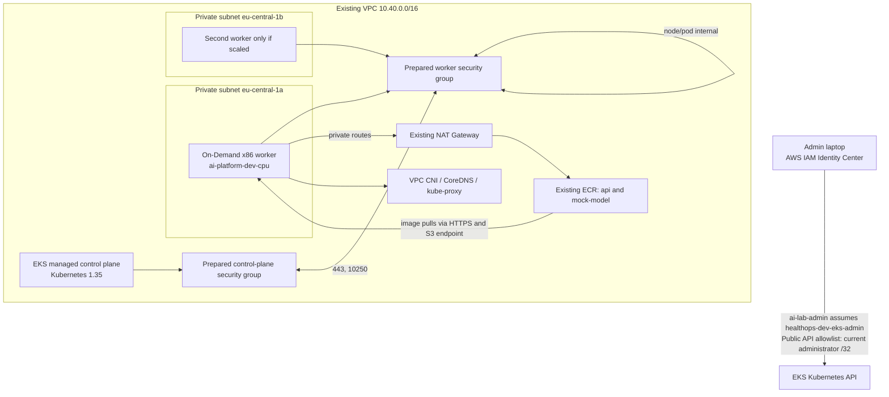

# HealthOps EKS dev deployment

**Status as of 8 October 2026:** The EKS cluster reports `ACTIVE`. A partial
apply created the cluster and some supporting resources, but the managed node
group and VPC CNI/CoreDNS add-ons are not present. The cluster is not ready for
application workloads. Networking and DNS flows below describe the intended
configuration after those components are deployed. This guide distinguishes
live resources from remaining configuration; no destroy has been run.

## Architecture



The existing network is reused through `module.network` outputs. The plan must
not create a second VPC, subnet, NAT Gateway, S3 endpoint, or copy of either
prepared security group.

| Responsibility | Proposed configuration |
|---|---|
| EKS control plane | AWS-managed Kubernetes API, etcd, scheduler and controllers |
| CPU workers | EKS managed node group in both existing private subnets; Amazon Linux 2023 x86_64; On-Demand |
| Node bootstrap | EKS-managed node group lifecycle; no SSH key or remote-access block |
| Pod networking | AWS VPC CNI EKS add-on, using a dedicated Pod Identity role |
| Cluster DNS and service forwarding | Managed CoreDNS and kube-proxy add-ons |
| Control-plane logs | All five EKS log types, CloudWatch retention of 30 days |
| Application images | Existing `healthops-dev/api` and `healthops-dev/mock-model` ECR repositories |
| Public application access | Not included; services remain ClusterIP and no ALB is created |

## How Kubernetes networking and DNS fit together

The cluster has two distinct IP ranges:

| Range/address | Meaning |
|---|---|
| VPC `10.40.0.0/16` | Overall AWS private network range. |
| Private subnet A `10.40.16.0/20` and B `10.40.32.0/20` | AWS assigns a private IP from a subnet to each worker node. The AWS VPC CNI also allocates pod IPs from VPC subnet capacity in its standard IPv4 mode. |
| EKS Service CIDR `172.20.0.0/16` | Separate virtual range used for Kubernetes Service `ClusterIP` addresses. It is not a VPC subnet and does not assign addresses to EC2 instances or pods. The live cluster reports this range; Terraform did not explicitly choose it. |

**VPC CNI** means Container Network Interface; it is not a VPN. It manages
pod networking and VPC IP allocation through worker network interfaces. A
pod's VPC CNI IP is the destination address used for pod-to-pod traffic.
Kubernetes Services add a stable virtual address in `172.20.0.0/16`.
`kube-proxy` forwards traffic sent to a Service IP to one of that Service's
ready pod IPs. Therefore a pod IP can change when a pod is replaced, while
clients can keep using the same Service name and address. A recreated Service
may receive a different ClusterIP; the cluster's Service CIDR is selected at
cluster creation and is not an ordinary update setting.

**CoreDNS** runs inside the Kubernetes cluster and answers DNS queries from
pods. In the checked-in manifests the mock-model Service is named `mock-model`
in namespace `ai-platform`. The API and mock-model are in that same namespace,
so the API uses the short name `mock-model`; its full DNS name is
`mock-model.ai-platform.svc.cluster.local`. CoreDNS returns that Service's
ClusterIP; `kube-proxy` then forwards the connection to a ready model pod.
CoreDNS also forwards non-Kubernetes names to an upstream resolver, so
workloads can resolve external names such as ECR endpoints. CoreDNS does not
create public DNS records or expose an application to users.

Public DNS at a registrar/provider is for people outside the cluster: a future
HealthOps domain record would point to a public application load balancer, which
would route requests to the API. No application load balancer or public
application DNS record is included in this milestone. `kubectl` uses the
separate AWS-provided EKS API endpoint DNS name, restricted by the
administrator's public IPv4 `/32`.

```text
API pod -> http://mock-model:8002
        -> CoreDNS resolves mock-model to Service ClusterIP (172.20.x.x)
        -> kube-proxy forwards TCP 8002 to ready model pod IP (10.40.x.x)

Future user -> public registrar DNS -> application load balancer
            -> secure-ai-api Service (port 8000) -> API pod (port 8000)

Administrator -> AWS SSO role -> AWS EKS API endpoint (not CoreDNS)
```

The API-to-model URL above is **internal pod-to-Service traffic**, not a URL
for a user's browser. Both application Services in the checked-in manifests
are `ClusterIP`, so they are reachable only from inside the cluster. There is
no public app DNS name, Ingress, or load balancer configured in this milestone.
The `secure-ai-api` Service will be the in-cluster address for the API. A
browser can reach it externally only after a separate ingress/load-balancer
and public DNS configuration is added. During development, use an approved
port-forward or internal test path instead.

### What do the two port fields mean?

The model container declares `containerPort: 8002` in
`kubernetes/base/mock-model-deployment.yaml`. Its Service declares `port: 8002`
and `targetPort: http` in `kubernetes/base/mock-model-service.yaml`; `http`
refers to the container port named `http`. Here both numeric ports happen to
be 8002, but they have different roles:

| Field | Example | Used by |
|---|---:|---|
| `containerPort` | `8002` | Port on which the mock-model process listens inside its pod. |
| Service `port` | `8002` | Port clients use on the stable Service address; this is the `:8002` in `http://mock-model:8002`. |
| Service `targetPort` | `http` → `8002` | Destination port on the selected pod; Kubernetes maps Service traffic to it. |

Likewise, the API process listens on container port 8000, and the
`secure-ai-api` Service exposes Service port 8000 and targets the API
container's named `http` port. The API's `MODEL_BASE_URL` points to the
mock-model Service, not directly to a pod IP. Kubernetes DNS resolves the
hostname; the port is used for the TCP connection, not resolved by DNS.

Inspect the live cluster's Service CIDR with:

```powershell
aws eks describe-cluster `
  --name ai-platform-dev `
  --region eu-central-1 `
  --profile ai-lab-admin `
  --query "cluster.kubernetesNetworkConfig.serviceIpv4Cidr" `
  --output text
```

Kubernetes `1.35` was selected on 6 October 2026. AWS lists it in standard
support through 27 March 2027. AWS's current VPC CNI, CoreDNS, and kube-proxy
compatibility tables include 1.35. Terraform queries the EKS API for the newest
compatible version of each add-on at plan time; those versions are visible in
the reviewed plan. Recheck regional EKS version and add-on availability before
deployment or upgrading:

- [EKS Kubernetes version lifecycle](https://docs.aws.amazon.com/eks/latest/userguide/kubernetes-versions.html)
- [VPC CNI versions](https://docs.aws.amazon.com/eks/latest/userguide/managing-vpc-cni.html)
- [CoreDNS versions](https://docs.aws.amazon.com/eks/latest/userguide/managing-coredns.html)
- [kube-proxy versions](https://docs.aws.amazon.com/eks/latest/userguide/managing-kube-proxy.html)

The EKS Pod Identity Agent is also installed so the VPC CNI can use its
dedicated IAM role. It is an identity prerequisite, not an application
platform component.

CloudWatch Logs encrypts log data at rest by default using service-managed
encryption; this lab does not create a separate customer-managed KMS key for
the cluster log group. The 30-day retention is intentional for a cost-conscious
development environment and must be increased before production. EKS clusters
running Kubernetes 1.28 and later also receive default envelope encryption for
all Kubernetes API data using an AWS-owned KMS key; a customer-managed key is
not configured in this milestone. See the AWS documentation for [CloudWatch
Logs encryption](https://docs.aws.amazon.com/AmazonCloudWatch/latest/logs/data-protection.html)
and [EKS default envelope encryption](https://docs.aws.amazon.com/eks/latest/userguide/envelope-encryption.html).

## Existing and proposed AWS resources

The known live network values below are verification references only. Terraform
uses module outputs instead of these IDs.

| Resource | Reference | Status |
|---|---|---|
| VPC | `vpc-0213b3c62cb94e86d` | Existing; reused through `module.network.vpc_id` |
| Private subnet A | `subnet-097a6504a725de799` | Existing; reused through `module.network.private_subnet_ids` |
| Private subnet B | `subnet-0a520b845174e472e` | Existing; reused through `module.network.private_subnet_ids` |
| Prepared additional control-plane SG | `sg-09328f4bbdd240d6c` | Existing; reused through `module.network.eks_control_plane_security_group_id` |
| Prepared worker SG | `sg-0b14ae0a05f3d32b7` | Existing; reused through `module.network.eks_worker_security_group_id` |
| NAT, S3 endpoint, routes and seven standalone egress rules | Existing network configuration | Already created and checked in AWS; not duplicated here |
| ECR images | `healthops-dev/api`, `healthops-dev/mock-model` | Already published; worker role gets pull-only permissions |
| EKS cluster | `ai-platform-dev` | Deployed; live AWS check reports `ACTIVE`, Kubernetes `1.35` |
| EKS add-ons | `eks-pod-identity-agent`, `kube-proxy` | Present in live add-on inventory; VPC CNI and CoreDNS are not present yet |
| EKS node group | `ai-platform-dev-cpu` | Not present in live AWS check; there are no worker nodes yet |
| Launch template, log group and administrator access entry | `ai-platform-dev` | Recorded in dev Terraform state from the partial apply |
| EKS cluster, worker and VPC CNI IAM roles | `healthops-dev-eks-cluster`, `healthops-dev-eks-workers`, `healthops-dev-eks-vpc-cni` | Created by bootstrap on 6 October 2026 with required AWS-managed policy attachments |
| EKS Terraform plan/apply policies | `healthops-dev-eks-plan-read`, `healthops-dev-eks-apply` | Created and attached on 6 October; Pod Identity permissions updated on 8 October 2026 |
| EKS administrator role | `healthops-dev-eks-admin` | Existing; trust is configured for the verified SSO role |

The existing administrator role trust names the previously verified IAM Identity
Center role:
`arn:aws:iam::429496640190:role/aws-reserved/sso.amazonaws.com/eu-central-1/AWSReservedSSO_AdministratorAccess_4af4e9b42a20d275`.
The role receives no broad AWS permissions; Kubernetes administrator rights
come from the EKS access entry and cluster-scoped
`AmazonEKSClusterAdminPolicy` association. Bootstrap configuration is the
source of truth; review its refreshed plan before changing IAM.

## Security-group attachment and communication

The cluster's `vpc_config` attaches the prepared additional control-plane SG.
EKS also creates and attaches its AWS-managed cluster SG to control-plane
interfaces. For the managed node group, a launch template attaches **only the
prepared worker SG**. It does **not** attach the AWS-managed cluster SG to
workers, and custom SGs in a launch template mean EKS does not automatically
add that managed SG to worker instances. This is deliberate: the prepared
standalone rules provide the required paths without inheriting the managed
cluster SG's broad default egress.

| Flow | Rule path |
|---|---|
| Worker to Kubernetes API | Worker SG egress TCP 443 to the control-plane SG; control-plane SG ingress TCP 443 from the worker SG |
| Control plane to kubelet and HTTPS webhooks | Control-plane SG egress TCP 10250 and 443 to worker SG; worker SG ingress on those ports from control-plane SG |
| Node and pod traffic between workers | Worker SG self-referencing all-protocol ingress and egress |
| Worker DNS | Worker SG egress UDP and TCP 53 to the VPC CIDR |
| Worker outbound registry/AWS HTTPS | Worker SG egress TCP 443 to `0.0.0.0/0`, routed through the existing private-subnet NAT; there is no public worker address or internet ingress |

These are the existing standalone `aws_vpc_security_group_*_rule` resources;
the EKS module does not take ownership of inline SG rules. Before deployment,
confirm the live rules still match this table and that the next plan contains no
unexpected SG rule revocations.

## IAM and workflow permissions

IAM roles and service policies are declared in bootstrap so the GitHub dev apply
role does not create or broadly administer IAM identities:

- Cluster role trusts `eks.amazonaws.com` and receives
  `AmazonEKSClusterPolicy`.
- Worker role trusts `ec2.amazonaws.com` and receives
  `AmazonEKSWorkerNodePolicy` plus `AmazonEC2ContainerRegistryPullOnly`.
- VPC CNI role trusts `pods.eks.amazonaws.com` for this account and this
  cluster only, and receives `AmazonEKS_CNI_Policy`.
- The apply role can create, describe, list, and delete Pod Identity
  associations for this cluster; permissions are limited to the cluster and
  its Pod Identity association resources.
- The plan role gets region- and resource-scoped EKS, launch-template, log-group
  and IAM role read access.
- The apply role gets narrowly named EKS cluster/node-group/add-on/access-entry
  actions, launch-template management, log retention and `iam:PassRole` limited
  to those three roles and their respective AWS services. It does not receive
  administrator access.

The EKS service roles and scoped plan/apply policies were created and attached
by a reviewed bootstrap apply on 6 October 2026 (11 resources added, none
changed or destroyed). The plan role's attachment and effective permissions
were then verified with AWS IAM policy simulation. The first EKS deployment
attempt failed because the apply policy did not allow
`eks:CreatePodIdentityAssociation` for the VPC CNI add-on. On 8 October, a
reviewed bootstrap apply updated the plan/apply policies in place (two policies
changed; no resources added or destroyed). IAM simulation confirmed the apply
role is allowed to create the association for this cluster. Subsequent applies
exposed missing `eks:TagResource` permission on the association ARN and
`iam:GetRole` for the VPC CNI role and, later, the worker role. The versioned
apply policy now includes scoped `eks:TagResource`/`eks:UntagResource` and
`iam:GetRole` only for the three named EKS service roles (cluster, workers,
and VPC CNI). These changes need a reviewed bootstrap apply; expect an in-place
update to the EKS apply managed policy. After applying it, generate and review
a fresh dev plan before retrying. Dev planning reads the three service roles
by name.
See [IAM policy map](IAM-POLICY-MAP.md).

GitHub repository Actions variables required by the plan and apply workflows:

| Variable | Value |
|---|---|
| `EKS_ADMIN_PUBLIC_IPV4_CIDR` | The administrator's **currently verified** public IPv4 `/32`; previously recorded CIDRs are historical and must not be assumed current |
| `EKS_ADMIN_IAM_ROLE_ARN` | `arn:aws:iam::429496640190:role/healthops-dev-eks-admin` |

The apply workflow requires the current CIDR to be entered again when a saved
plan creates or changes the EKS cluster. It must exactly match the CIDR in the
plan's repository variable. If the address has changed, update the variable and
generate a new plan; do not apply a plan made with the old address.

## Administrator access

Check the current public address immediately before planning:

```powershell
aws sso login --profile ai-lab-admin
aws sts get-caller-identity --profile ai-lab-admin
$currentIpv4 = (Invoke-RestMethod -Uri "https://checkip.amazonaws.com").Trim()
$currentAdminCidr = "$currentIpv4/32"
$currentAdminCidr
```

Compare that `/32` with `eks_administrator.public_ipv4_cidr` in the ignored
`infrastructure/terraform/environments/dev/terraform.tfvars` and the GitHub
repository variable. Update either value if it differs; never widen it to
`0.0.0.0/0`. For GitHub applies, enter the same current CIDR in the
`confirmed_admin_public_ipv4_cidr` workflow input.

Configure a named AWS CLI role profile once in the current PowerShell session:

```powershell
aws configure set role_arn arn:aws:iam::429496640190:role/healthops-dev-eks-admin --profile healthops-eks-admin
aws configure set source_profile ai-lab-admin --profile healthops-eks-admin
aws configure set role_session_name ikteaja-eks-admin --profile healthops-eks-admin
aws configure set region eu-central-1 --profile healthops-eks-admin
aws sts get-caller-identity --profile healthops-eks-admin
aws eks update-kubeconfig --profile healthops-eks-admin --name ai-platform-dev --region eu-central-1 --alias ai-platform-dev
kubectl config use-context ai-platform-dev
kubectl auth can-i get nodes
kubectl get nodes -o wide
```

The first identity check should show the `ai-lab-admin` SSO role. The second
should show an assumed `healthops-dev-eks-admin` role. `kubectl` authentication
uses the role profile in kubeconfig; neither the SSO administrator nor the
Terraform execution role is granted Kubernetes access directly.

## Lab sizing and limitations

The default node group is one `t3.medium` (`2 vCPU`, `4 GiB`), minimum 1,
desired 1, maximum 2. `eks_cpu_instance_type` is configurable and must be an
x86_64 EKS-supported type in the selected region. The API and mock-model images
have small lab resource requests, but the node also runs system pods. If memory
pressure or `Insufficient memory` events appear, use `t3.large` (8 GiB) and
review cost before applying.

One desired node is a cost-conscious learning setup, **not highly available**.
Both subnets are eligible for node placement, but one node does not provide
cross-AZ capacity or node-failure tolerance; CoreDNS's two default replicas
can share that single node. `max_size = 2` only sets the Auto Scaling group's
upper bound. It does not install a cluster autoscaler or cause pending pods to
add nodes. Karpenter and GPU nodes are later milestones.

## Deployment procedure

Do not run an apply until the administrator CIDR has just been verified, the
bootstrap changes are deployed, and the dev plan has been reviewed.

1. Confirm the current address using the commands above. Update the ignored
   local tfvars and GitHub repository variable if needed.
2. From the repository root, log in to the verified administrator profile,
   review, and apply the bootstrap IAM plan through the existing bootstrap
   process:

   ```powershell
   aws sso login --profile ai-lab-admin
   $env:AWS_PROFILE = "ai-lab-admin"
   terraform -chdir=infrastructure/terraform/bootstrap init -lockfile=readonly
   terraform -chdir=infrastructure/terraform/bootstrap validate
   terraform -chdir=infrastructure/terraform/bootstrap plan -out=bootstrap.tfplan
   terraform -chdir=infrastructure/terraform/bootstrap show bootstrap.tfplan
   ```

   Apply only after confirming it creates the three EKS service roles, their
   scoped managed-policy attachments, and the plan/apply EKS permissions, with
   no unexpected IAM changes:

   ```powershell
   terraform -chdir=infrastructure/terraform/bootstrap apply bootstrap.tfplan
   ```

3. Run a dev plan using the normal Terraform Plan workflow after bootstrap has
   completed. The local equivalent, from the repository root, is:

   ```powershell
   terraform -chdir=infrastructure/terraform/environments/dev init -lockfile=readonly
   terraform -chdir=infrastructure/terraform/environments/dev validate
   terraform -chdir=infrastructure/terraform/environments/dev plan -out=dev.tfplan
   terraform -chdir=infrastructure/terraform/environments/dev show dev.tfplan
   ```

4. Review the exact plan for the `ai-platform-dev` cluster, one named CPU launch
   template and managed node group, control-plane log group, four managed
   add-ons (Pod Identity Agent, VPC CNI, kube-proxy, CoreDNS), and administrator
   access entry/association. It must reuse the existing VPC, subnets, NAT,
   endpoint and SG rules, with no unrelated deletes or replacements.
5. For CI deployment, use the protected manual Apply workflow with the
   successful `main` plan-run ID, type `apply-dev`, and enter the freshly
   verified CIDR in `confirmed_admin_public_ipv4_cidr`. The workflow refuses an
   EKS create/update if the entered CIDR differs from either the repository
   variable or the CIDR embedded in the saved plan. The apply workflow does not
   override Terraform inputs already recorded in a saved plan.
   For local deployment, apply only the reviewed saved plan after independently
   checking that the CIDR in it is current:

   ```powershell
   terraform -chdir=infrastructure/terraform/environments/dev apply dev.tfplan
   ```

6. Use the administrator role profile above to run the post-deployment checks.
   Do not enable a public application endpoint as part of this milestone.

The version data sources ask AWS for compatible add-on builds, so a plan needs
valid AWS credentials and the bootstrap plan role's newly applied read access.
If a saved plan becomes stale, create and review a fresh plan rather than
applying the stale file.

## Post-deployment acceptance checks

These commands are for after an explicitly approved deployment. They are not
evidence that the resources exist now.

```powershell
aws eks describe-cluster --name ai-platform-dev --region eu-central-1 --profile healthops-eks-admin --query "cluster.status" --output text
aws eks describe-nodegroup --cluster-name ai-platform-dev --nodegroup-name ai-platform-dev-cpu --region eu-central-1 --profile healthops-eks-admin --query "nodegroup.status" --output text
kubectl get nodes -o wide
kubectl get pods -n kube-system -o wide
aws eks list-addons --cluster-name ai-platform-dev --region eu-central-1 --profile healthops-eks-admin
```

Expect cluster and node group status `ACTIVE`, the expected worker `Ready`, and
the VPC CNI, CoreDNS, kube-proxy and Pod Identity Agent pods healthy. CoreDNS
creation is explicitly ordered after the worker group so it has schedulable
capacity.

To run the existing API and mock-model manifests against the published ECR
images, use an immutable tag or digest from the ECR publishing workflow. This
PowerShell example replaces the local image name in memory; it does not edit
the checked-in manifests:

```powershell
$apiImage = Read-Host "Paste the full ECR API URI with immutable tag or @sha256 digest"
$modelImage = Read-Host "Paste the full ECR mock-model URI with immutable tag or @sha256 digest"
kubectl apply -f .\kubernetes\base\namespace.yaml
kubectl apply -f .\kubernetes\base\api-service.yaml
kubectl apply -f .\kubernetes\base\mock-model-service.yaml
$apiManifest = Get-Content .\kubernetes\base\api-deployment.yaml -Raw
$apiManifest = $apiManifest.Replace("secure-ai-platform-api:0.2.0", $apiImage)
$apiManifest | kubectl apply -f -
$modelManifest = Get-Content .\kubernetes\base\mock-model-deployment.yaml -Raw
$modelManifest = $modelManifest.Replace("secure-ai-platform-mock-model:0.1.0", $modelImage)
$modelManifest | kubectl apply -f -
kubectl rollout status deployment/secure-ai-api -n ai-platform --timeout=5m
kubectl rollout status deployment/mock-model -n ai-platform --timeout=5m
kubectl get pods -n ai-platform -o wide
kubectl port-forward -n ai-platform service/secure-ai-api 8080:8000
```

In another PowerShell window, verify the API health and readiness endpoints and
exercise the API-to-model request:

```powershell
Invoke-RestMethod http://127.0.0.1:8080/health
Invoke-RestMethod http://127.0.0.1:8080/ready
Invoke-RestMethod -Method Post -Uri http://127.0.0.1:8080/ask `
  -ContentType "application/json" `
  -Body '{"question":"How does the HealthOps lab route API traffic to the mock model?"}'
```

The checked-in API manifest sets `MODEL_BASE_URL=http://mock-model:8002`, the
same-namespace ClusterIP Service. That confirms DNS and internal service
connectivity in the `/ask` request. The API and model deployments are application
acceptance tests; Terraform does not install them.

## Troubleshooting

### Worker nodes do not join

- Confirm cluster and node group are `ACTIVE`, the nodes use the two existing
  private subnets, and the node group has no public IP or SSH configuration.
- Verify the worker launch template has only the prepared worker SG, and the
  cluster has the prepared control-plane SG in addition to its AWS-managed SG.
- Check both sides of TCP 443 (worker to API), TCP 10250 and 443 (control plane
  to worker), worker self-referencing node traffic, DNS TCP/UDP 53 and HTTPS
  egress. Do not add inline rules to the `aws_security_group` resources.
- Confirm private routes reach NAT, the S3 gateway endpoint is attached, and
  outbound DNS/HTTPS works. Inspect node-group health issues and CloudWatch
  control-plane logs before changing security rules.

### `kubectl` says unauthorized or forbidden

- Run `aws sts get-caller-identity --profile healthops-eks-admin`; it must show
  the assumed dedicated role, not only `ai-lab-admin`.
- Verify the role's trust and `AmazonEKSClusterAdminPolicy` access-policy
  association for this cluster, then refresh kubeconfig.
- Confirm the public address in the cluster allowlist still equals the
  administrator's current `/32`. Update the GitHub variable and create a new
  plan before applying any CIDR change.

### Pods show `ImagePullBackOff`

- Check the image URI/tag/digest and repository names:
  `healthops-dev/api` and `healthops-dev/mock-model`.
- Confirm the node role has `AmazonEC2ContainerRegistryPullOnly`; never grant
  image-publisher credentials to pods or nodes.
- Inspect `kubectl describe pod` events for ECR authentication, DNS, HTTPS or
  S3 layer errors. Check the private NAT route, ECR API/registry reachability,
  S3 gateway endpoint and worker DNS egress.
- Use immutable ECR tags/digests that still exist; do not change a running
  Deployment to a local `kind` image name.

## Cleanup order and retained resources

Remove application Deployments/Services first. Then use a reviewed Terraform
plan to remove the EKS add-ons/access entry, managed node group and launch
template before removing the cluster. Delete the EKS control-plane log group
only when its logs are no longer needed. Remove the bootstrap-managed IAM roles
only after the cluster is gone and their policies are detached; their
`prevent_destroy` lifecycle guards require an intentional bootstrap change.

The EKS service-linked role may remain after cluster deletion. Existing VPC,
subnets, NAT, routes, endpoint and prepared security groups are independent
network resources and must not be removed as part of an EKS-only cleanup.
ECR repositories/images and the ECR encryption key also remain. Review each
plan; do not use a broad environment destroy for this milestone.
