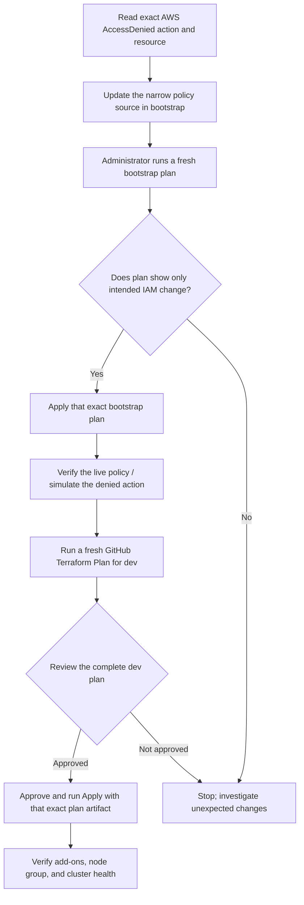

# EKS Terraform deployment: IAM troubleshooting knowledge base

This article records the EKS deployment failures seen in the HealthOps dev
environment, what each message means, the permission changes made, and the
safe workflow for applying bootstrap IAM changes before retrying a dev
deployment.

## Current state and important distinction

The latest reported deployment reached EKS managed node-group creation and
then failed because the GitHub Terraform apply role lacked
`iam:ListAttachedRolePolicies` on `healthops-dev-eks-workers`. The bootstrap
policy source now grants `iam:GetRole` and `iam:ListAttachedRolePolicies` on
the three named EKS service roles only:

- `healthops-dev-eks-cluster`
- `healthops-dev-eks-workers`
- `healthops-dev-eks-vpc-cni`

The source file is
[`eks-apply.json`](../../infrastructure/terraform/bootstrap/policies/managed/eks-apply.json).
The latest worker-role permission change has **not been confirmed as applied
in AWS**. A source change is not an AWS permission change until a reviewed
bootstrap Terraform plan has been applied. Check the live policy or a fresh
bootstrap plan before assuming it is active.

The cluster was last reported as `ACTIVE`, with the Pod Identity Agent and
`kube-proxy` present. VPC CNI, CoreDNS, and the managed node group were not
confirmed deployed. Check live AWS state before continuing; failed Terraform
applies can leave some resources successfully created.

## Error history

| Error encountered | What it means | Resolution / current status |
|---|---|---|
| ECR KMS key creation: `kms:TagResource` denied | The apply role could create the KMS key request, but could not apply requested key tags. | Add the required KMS tag permissions to the scoped KMS apply policy. This was addressed earlier in the IAM setup. |
| Dev plan: `iam:GetRole` denied for EKS service roles and `eks:DescribeAddonVersions` denied | The plan role could not read EKS role metadata or query compatible managed add-on versions. | Add scoped role reads in `eks-plan-read` and regional `eks:DescribeAddonVersions`. The EKS planning permissions were bootstrapped and checked. |
| VPC CNI add-on: `eks:CreatePodIdentityAssociation` denied | Creating the add-on also creates its Pod Identity association for the `aws-node` service account. | Add cluster/association-scoped Pod Identity association permissions to the EKS apply policy. The bootstrap policy update was applied and the create permission was verified using IAM simulation. |
| VPC CNI add-on: `eks:TagResource` denied on `podidentityassociation/...` | EKS/Terraform also tags the Pod Identity association; allowing create/delete/describe alone was insufficient. | Add `eks:TagResource` and `eks:UntagResource`, scoped to the cluster's Pod Identity association ARN. The deployment later advanced beyond this error; confirm the live policy if it recurs. |
| VPC CNI add-on: `iam:GetRole` denied | EKS needs to read the IAM role configured for the add-on, `healthops-dev-eks-vpc-cni`. | Add narrowly scoped `iam:GetRole`. The deployment later advanced beyond this error; confirm the live policy if it recurs. |
| Managed node group: `iam:GetRole` denied for `healthops-dev-eks-workers` | EKS needs to inspect the node group's worker role. The previous `GetRole` grant covered only the CNI role. | Expand the source policy's `iam:GetRole` resource list to the three named EKS service roles. The source is updated; apply it through bootstrap before retrying. |
| Managed node group: `iam:ListAttachedRolePolicies` denied for `healthops-dev-eks-workers` | EKS checks which AWS-managed policies are attached to the node role during node-group validation. `iam:GetRole` alone does not allow this separate IAM API operation. | Add `iam:ListAttachedRolePolicies`, alongside `iam:GetRole`, scoped to the three named EKS service roles. This latest addition is source-only until a reviewed bootstrap plan is applied. |
| Applying a saved bootstrap plan: `Saved plan is stale` | Bootstrap state changed after that plan was generated; Terraform refuses to apply an outdated snapshot. | Generate a new plan from the latest state, inspect it, then apply that exact fresh plan. Never try to reuse the stale plan. |
| Saved-plan warning: `Ignoring variable when applying a saved plan` | The apply command or workflow supplied a variable that differed from the value already embedded in the saved plan. | Do not override Terraform variables at saved-plan apply time. Change inputs and create a new plan instead. The workflow should apply the exact reviewed artifact. |

AWS errors often reveal permissions incrementally: fixing one denied action can
let the operation progress far enough to expose the next missing action. For
each new error, identify the exact principal, action, resource ARN, and
Terraform operation. Add only the smallest required permission to the
responsible policy, then review and apply the bootstrap change.

## Permission and responsibility map

```text
Administrator (ai-lab-admin SSO)
    |
    +-- Terraform bootstrap root/state
    |      Owns IAM deployment policies and EKS service roles
    |      Source: infrastructure/terraform/bootstrap/
    |      Apply role policy: policies/managed/eks-apply.json
    |      Plan role policy:  policies/managed/eks-plan-read.json
    |
    +-- GitHub OIDC Terraform plan role
    |      Reads dev infrastructure and EKS metadata
    |
    +-- GitHub OIDC Terraform apply role
           Manages named dev resources; may pass only the EKS service roles
           Does not manage its own IAM policy
                  |
                  +-- EKS cluster role: healthops-dev-eks-cluster
                  +-- Worker role:      healthops-dev-eks-workers
                  +-- VPC CNI role:     healthops-dev-eks-vpc-cni
```

| Permission / policy | What uses it | Source of truth |
|---|---|---|
| `eks:CreatePodIdentityAssociation`, association describe/delete/list, and scoped `eks:TagResource`/`eks:UntagResource` | Terraform creating/updating the VPC CNI add-on's Pod Identity association | `bootstrap/policies/managed/eks-apply.json` |
| `iam:GetRole`, `iam:ListAttachedRolePolicies` | EKS reads role metadata and attached policies during resource creation | Same apply policy, limited to the three named role ARNs |
| `iam:PassRole` | Terraform/EKS passes the appropriate execution role to EKS, EC2, or Pod Identity | Same apply policy, role ARNs and `iam:PassedToService` constrained |
| `eks:DescribeAddonVersions`, IAM role reads for planning | Terraform plan discovers supported add-on versions and existing service roles | `bootstrap/policies/managed/eks-plan-read.json` |
| EKS service-role trust and AWS-managed role-policy attachments | EKS control plane, worker EC2 instances, and VPC CNI | `bootstrap/eks_workload_roles.tf` |

The GitHub **dev** apply role is intentionally not allowed to update deployment
IAM policy. Permission changes belong to the bootstrap root, run by an
authorized administrator.

## End-to-end recovery workflow



The bootstrap plan updates permissions for future dev applies; it does not
resume or repair a failed dev plan. After bootstrap succeeds, the dev plan must
be regenerated from the current source and state.

## Safe workflow for a bootstrap permission fix

Run from the repository root in PowerShell. The `.local\iam` folder stores
generated local plan files; it is not the policy source and is Git-ignored.

```powershell
aws sso login --profile ai-lab-admin
$env:AWS_PROFILE = 'ai-lab-admin'
aws sts get-caller-identity

New-Item -ItemType Directory -Force .local/iam
terraform '-chdir=infrastructure/terraform/bootstrap' init -lockfile=readonly
terraform '-chdir=infrastructure/terraform/bootstrap' validate
terraform '-chdir=infrastructure/terraform/bootstrap' plan '-out=../../../.local/iam/eks-permission-fix.tfplan'
terraform '-chdir=infrastructure/terraform/bootstrap' show '../../../.local/iam/eks-permission-fix.tfplan'
```

Before applying, verify the plan:

1. It is for the **bootstrap** root, not `environments/dev`.
2. It changes only the expected IAM policy resource (normally an in-place
   update to `aws_iam_policy.eks_apply`).
3. It contains no unexpected role, trust, attachment, state-bucket, add, or
   destroy actions.
4. If the plan says no changes, the source and state agree; do not apply an old
   plan to try to force an update.

If the plan is exactly the reviewed change, apply that saved plan:

```powershell
terraform '-chdir=infrastructure/terraform/bootstrap' apply '../../../.local/iam/eks-permission-fix.tfplan'
```

If Terraform says the plan is stale, discard it and generate/show a new plan.
Saved plans are snapshots, not live references to source code. Applying one
does not include source edits made after it was generated.

After bootstrap succeeds, confirm the policy document or use IAM policy
simulation for the newly allowed action and resource. Then run a fresh dev
Terraform Plan, review the full proposed infrastructure changes, and use that
exact plan artifact in the approved dev apply workflow. Do not retry a failed
or old dev plan.

## Saved plan files versus policy files

- `infrastructure\terraform\bootstrap\policies\managed\eks-apply.json` is
  versioned policy **source**. Review and commit this source change.
- `.local\iam\eks-permission-fix.tfplan` is generated **plan output**. It
  describes a proposed change and can contain sensitive configuration values.
  Keep it local, do not commit it, and do not treat other saved plans as
  substitutes.
- `infrastructure\terraform\bootstrap\bootstrap.tfplan`,
  `bootstrap-refresh.tfplan`, and
  `infrastructure\terraform\environments\dev\bootstrap.tfplan` are separate
  older snapshots from different runs/roots. Their names do not make them
  current or interchangeable. Always check the Terraform root, timestamp,
  plan contents, and staleness.

## Related references

- [EKS deployment guide](../eks-deployment.md)
- [IAM ownership and policy map](../IAM-POLICY-MAP.md)
- [EKS module configuration and architecture](../../infrastructure/terraform/modules/eks/eks.md)
