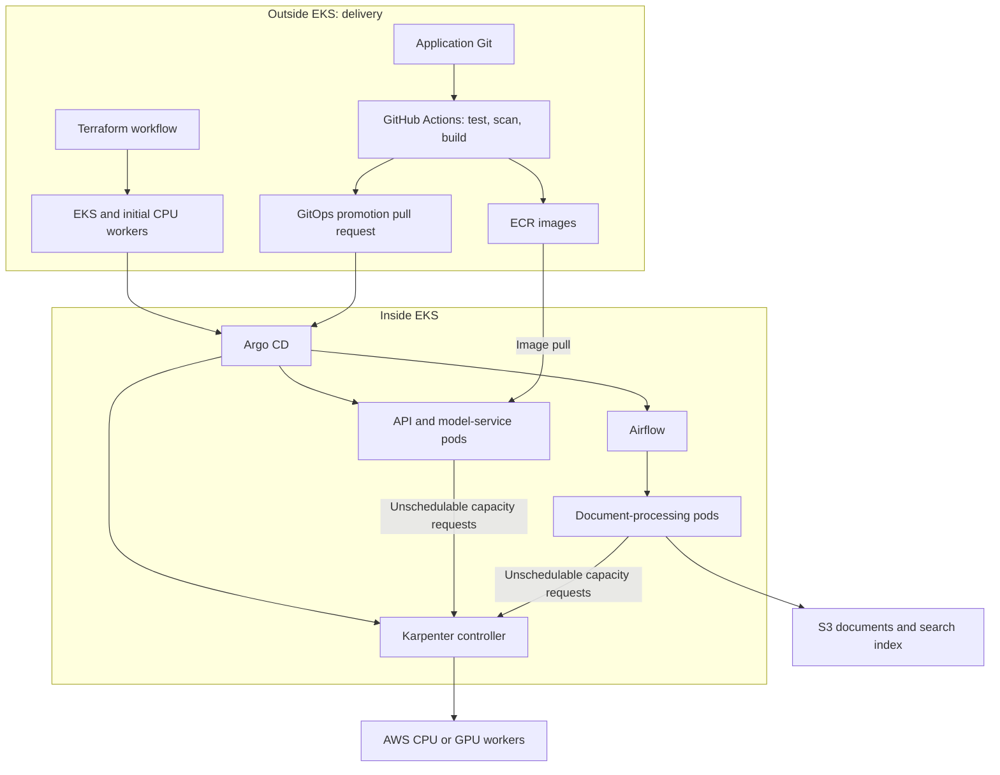
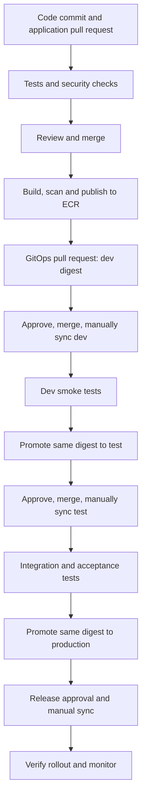
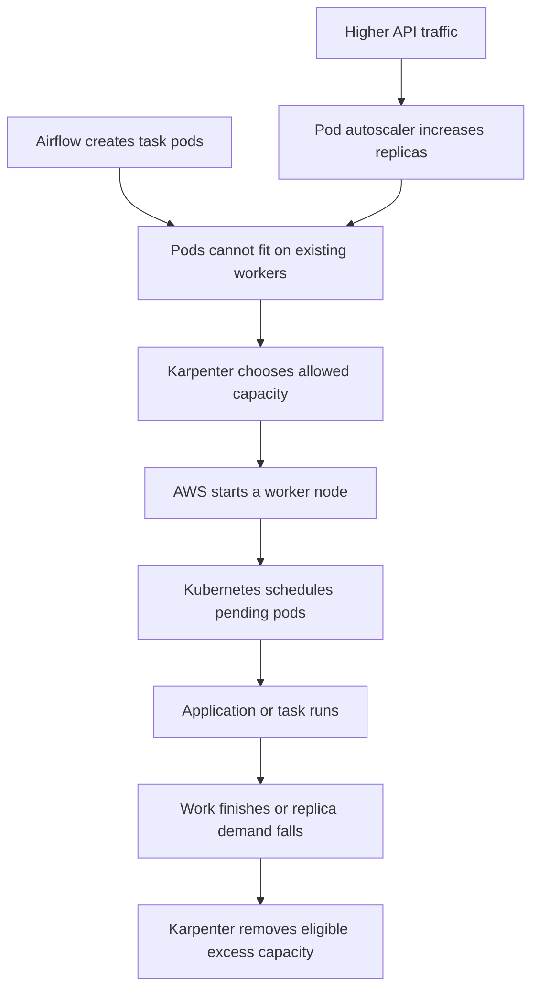
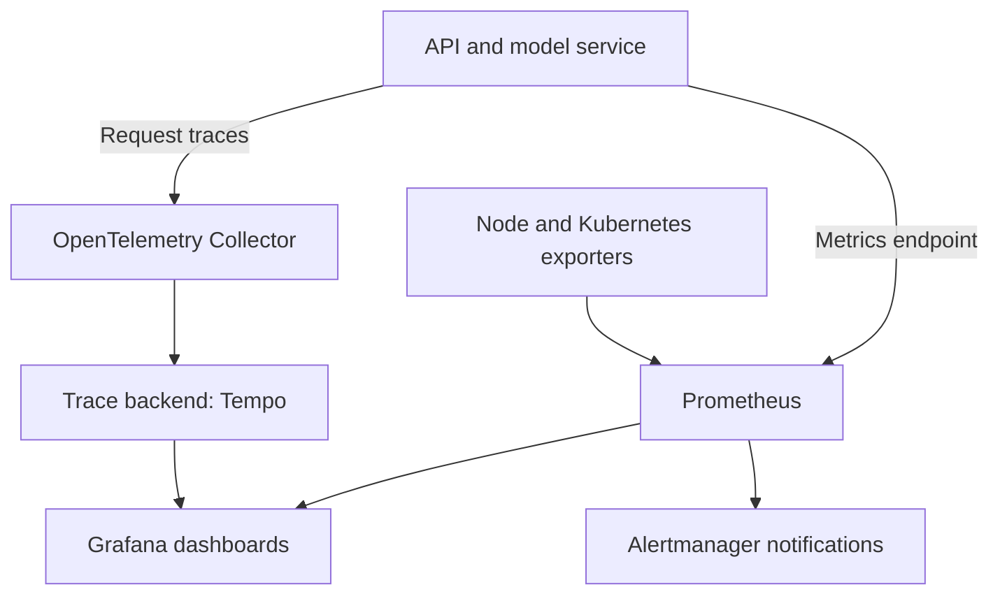

# HealthOps AI Infrastructure — Tools and Deployment Workflow

Status: proposed design. ECR repositories have been created; the remaining milestones below must be implemented and verified.

## 1. What comes next?

1. Publish tested API and mock-model images to ECR.
2. Complete private-node outbound connectivity and administrator access.
3. Create EKS with an initial CPU managed node group.
4. Bootstrap Argo CD.
5. Install monitoring and deploy the API and mock-model.
6. Add Karpenter and verify CPU node scaling.
7. Add Airflow for document processing.
8. Add GPU capacity and real model serving.

Prepare tool configuration and AWS permissions before creating EKS. Install their Kubernetes components after EKS and its initial workers are ready.

## 2. Tools, location and responsibility

| Tool | Where it works | Responsibility | Installation stage |
|---|---|---|---|
| Terraform | GitHub Actions infrastructure workflows | Creates networking, ECR, IAM, EKS and initial workers | Before and during cluster creation |
| GitHub Actions | GitHub runners | Tests, scans, builds and publishes images; proposes promotions | Before EKS |
| ECR | AWS | Stores versioned container images | Before EKS |
| Argo CD | EKS, `argocd` namespace | Applies Kubernetes configuration from Git | After EKS |
| Prometheus | EKS, monitoring namespace | Collects and stores metrics | After Argo CD |
| Grafana | EKS, monitoring namespace | Displays dashboards from monitoring backends | With Prometheus |
| OpenTelemetry | Application code and an EKS Collector | Instruments requests and forwards telemetry | With application deployment |
| Tempo, optional trace backend | EKS or managed service | Stores traces for Grafana to query | When enabling stored traces |
| Karpenter | Controller on initial CPU workers | Creates and removes AWS worker nodes | After working application baseline |
| Airflow | EKS, airflow namespace, plus metadata database | Schedules document-processing tasks and retries | After baseline and CPU scaling |
| Horizontal Pod Autoscaler | Kubernetes controller | Adjusts application replica count | When testing application scaling |
| vLLM | GPU workers in EKS | Serves a real language model | Later GPU milestone |

Ownership rule: Terraform manages AWS infrastructure and the initial Argo CD installation. Argo CD manages subsequent platform charts and application manifests. Do not assign the same resource to both tools.

## 3. Architecture

The Kubernetes scheduler places pods on suitable nodes. Karpenter supplies capacity; it does not replace the scheduler. GPU pods require GPU resource requests, suitable node configuration and NVIDIA drivers/device support.

## 4. Code commit to dev, test and production

Build an image once and promote the same immutable digest through all environments.

1. Developer opens a pull request. GitHub Actions tests the application and checks dependencies and security.
2. After review and merge, the publishing job builds and scans API/model images.
3. GitHub uses OIDC temporary AWS credentials and a dedicated publisher role to push to ECR. Keep this role separate from Terraform plan/apply roles.
4. Tag images with the full Git commit ID and record their digests. Kubernetes deployment references use the digest.
5. A GitOps pull request updates the dev image reference. Argo CD detects the approved change; an operator manually syncs it.
6. Run health, readiness and API-to-model smoke tests in dev.
7. Promote the same digest to test through another GitOps pull request and manual sync. Run integration and acceptance tests.
8. Promote the tested digest to production after release approval. Manually sync and verify the rollout.
9. Watch error rates, latency and resource usage. To roll back, revert the environment configuration to the previous digest in Git and sync it. Database changes may need a separate recovery plan.

Keep automatic sync disabled for this manual-deployment workflow. Application-code merge and ECR publishing do not themselves deploy an application.

## 5. Airflow: document-processing scenario

Example: a team uploads new hospital policy documents to S3.

1. Airflow starts a scheduled ingestion workflow.
2. A task identifies new documents.
3. Task pods extract text, split it into sections and generate embeddings.
4. Another task updates the search index and records ingestion status.
5. Failed tasks retry according to configured limits; persistent failures raise an alert.
6. The API can now retrieve the new document sections when answering a question.

With Kubernetes Executor, Airflow tasks run in separate Kubernetes pods. Airflow also needs a persistent metadata database; use PostgreSQL with durable storage for the lab, and a managed database for a future production design.

Airflow orchestrates background jobs. Interactive `/ask` requests go directly through the API, search index and model service. Airflow does not replace GitHub Actions or Argo CD.

## 6. Autoscaling workflow

- The pod autoscaler changes replica count; Karpenter changes node capacity.
- Configure CPU and GPU NodePools separately with limits and suitable instance constraints.
- Define accurate pod resource requests so scheduling and capacity decisions work.
- Keep core controllers on initial CPU workers so Karpenter can operate when its workload pools are empty.
- Configure disruption budgets and consolidation policies to protect running workloads.

## 7. Observability workflow

| Question | Tool or signal |
|---|---|
| Are requests failing? | Prometheus request/error metrics |
| Which request stage is slow? | OpenTelemetry traces stored in Tempo |
| Are workers overloaded? | Node and Kubernetes metrics in Grafana |
| Did document processing fail? | Airflow task status and collected task logs |
| Why did a pod restart? | Kubernetes events and container logs |

Prometheus stores metrics, not application traces. Grafana queries data sources; it is not the primary telemetry storage. OpenTelemetry collects and forwards telemetry; configure a backend for each signal you retain. Add a log backend separately when centralized logs become a milestone.

## 8. Environment and repository layout

For the learning lab, use one cluster with `healthops-dev`, `healthops-test` and `healthops-prod` namespaces. The production namespace is a simulation using synthetic data. Namespaces share cluster infrastructure and do not provide the isolation of separate clusters/accounts.

For a real deployment, use a separate production cluster and AWS account, with separate data, secrets and access controls.

| Repository responsibility | Suggested contents |
|---|---|
| Application | `app/`, `model_service/`, tests, Dockerfiles, build workflows |
| Infrastructure | Terraform modules, environment configuration, plan/apply workflows |
| GitOps | Platform Helm values and Kubernetes configuration for dev/test/prod |

These are logical responsibilities. They can initially remain in the existing repository under separate folders, then move into separate repositories when needed.

GitOps folders can include `platform/argocd`, `platform/monitoring`, `platform/karpenter`, `platform/airflow`, and `environments/dev`, `environments/test`, `environments/prod`. Pin chart versions and environment image digests. Keep secret values out of Git.

## 9. Milestone verification checklist

- [ ] API and mock-model images published to ECR with commit tags and recorded digests.
- [ ] EKS workers can pull images and reach required services.
- [ ] Administrator can access EKS using the planned access path.
- [ ] Argo CD can read Git and perform a manual dev sync.
- [ ] API health/readiness and API-to-model checks pass.
- [ ] Prometheus collects metrics and Grafana displays them.
- [ ] A test request produces a trace visible through the trace backend.
- [ ] Pending CPU pods cause Karpenter to add a node within configured limits.
- [ ] Airflow ingests a synthetic document and handles a deliberately failed task.
- [ ] The same image digest is promoted dev → test → production simulation.
- [ ] A Git revert and manual sync restore a previous application version.
- [ ] GPU scheduling and inference are verified in the later GPU milestone.

Use the agreed lab cycle: apply → learn/test/document → destroy. Verify leftover images, storage and other chargeable resources after teardown.

## 10. Official references

- [Argo CD: CI automation and GitOps](https://argo-cd.readthedocs.io/en/stable/user-guide/ci_automation/)
- [Argo CD: automated sync policy](https://argo-cd.readthedocs.io/en/stable/user-guide/auto_sync/)
- [Karpenter: getting started](https://karpenter.sh/docs/getting-started/)
- [Apache Airflow: Kubernetes deployment](https://airflow.apache.org/docs/apache-airflow/stable/administration-and-deployment/kubernetes.html)
- [OpenTelemetry Collector](https://opentelemetry.io/docs/collector/)
- [AWS ECR: images on EKS](https://docs.aws.amazon.com/AmazonECR/latest/userguide/ECR_on_EKS.html)

