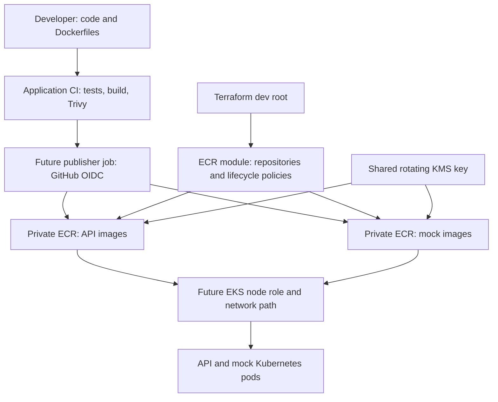

# ECR module: private container image storage

## Goal

Create a secure place in AWS to store the API and mock-model Docker images.
Amazon Elastic Container Registry (ECR) stores images; it does not run applications.
Amazon EKS will later pull these images and run them as containers.

For example, the image for commit `abc123` is uploaded once to `healthops-dev/api:abc123`.
The deployment can then reference its immutable image digest. The mock service has
its own repository so the two applications can be released independently.

**This milestone creates repositories, encryption and cleanup configuration.
It does not create EKS, publish images automatically, or change the network.**

## What this module creates

| Resource | Dev configuration | Purpose |
|---|---|---|
| Private API repository | `healthops-dev/api` | Stores API image versions |
| Private mock repository | `healthops-dev/mock-model` | Stores mock image versions |
| Shared customer-managed KMS key | Tag `Name=healthops-dev-ecr-key` | Encrypts both repositories; rotation enabled |
| Two lifecycle policies | Untagged images expire after 14 days | Removes eligible untagged images |
| Immutable image tags | Both repositories | Prevents an existing tag from being overwritten |
| Scan on push | Both repositories | Requests vulnerability scanning after upload |

Default resource count: **5 managed resources**: two repositories, two lifecycle policies,
one KMS key. AWS also manages service grants for ECR's use of the key.
The caller identity and partition are data lookups, not infrastructure resources.

All repositories carry `Project`, `Environment`, `ManagedBy`, `Owner`, `Name`,
`Component` and `Service` tags. The key carries the same shared tags without `Service`.
No public or cross-account repository policy is created. IAM still controls access.

## Workflow and responsibility mapping



| Layer | Configured here? | Responsibility |
|---|---|---|
| Dev Terraform root | Integration snippets | Calls `module.ecr`; supplies naming and tags |
| AWS provider | Already in dev root | Region, credentials and account guard |
| ECR module | Yes | Image storage, encryption, scan-on-push and lifecycle |
| Terraform plan role | Supplementary policy supplied | Reads repository/key configuration |
| Terraform apply role | Supplementary policy supplied | Manages the module's AWS resources |
| Image publisher | Next milestone | Pushes tested images using separate scoped permissions |
| EKS pull identity | Later | Authorizes nodes to download the images |
| Network module | Existing, independent | Subnets and routing; not passed to ECR |

A child `required_providers` block declares a dependency. It does not duplicate the
root's provider configuration. Do not put an AWS profile or credentials inside this module.

Your existing private subnets have no NAT gateway or VPC endpoints. Creating ECR
will not make them able to pull images. Before EKS, choose an outbound path or the
required private endpoints, including ECR API, ECR Docker and S3 for image layers,
plus other endpoints needed by the cluster. Interface endpoints and NAT can add costs.

## Files and their purpose

| File | Function |
|---|---|
| `versions.tf` | Declares Terraform and AWS provider requirements |
| `variables.tf` | Validates repository names, retention and input tags |
| `kms.tf` | Creates the shared rotating encryption key |
| `main.tf` | Creates private repositories with immutable tags and scanning |
| `lifecycle.tf` | Defines cleanup of old untagged images |
| `outputs.tf` | Returns repository URLs, ARNs and the encryption key ARN |
| `README.md` | Explains setup, use, costs and cleanup |

The bundle also includes `integration/*.tf.example` and two supplementary IAM policies.
The `.example` files are instructions to append configuration, not complete root modules.

## Security and cost choices

- **KMS:** One customer-managed key is shared across both repositories. AWS lists a
  base charge of USD 1 per key-month, prorated, plus applicable requests. Rotation
  can add charges for retained rotated key material. This is an additional key beyond
  the existing document and flow-log keys.
- **Lower-cost alternative:** ECR's default AES-256 encryption is encrypted at rest
  without a customer-managed key fee. This implementation uses a CMK to fit the
  project's existing security scans. If you prefer AES-256, change the design and
  explicitly review relevant scanner policies **before creating the repositories**.
  ECR repository encryption cannot be changed in place afterward.
- **Storage:** Stored image data incurs ECR storage charges. Avoid pushing every
  local experiment. No GPU, EC2 worker, NAT gateway or endpoint is created here.
- **Scanning:** Check the registry scan type before deployment. Basic scanning has no
  additional scan charge; enhanced scanning uses Amazon Inspector pricing. This
  module does not overwrite account-wide scanning settings. Enhanced settings can
  change the effective scanning behavior. Keep the existing Trivy blocking CI checks.
- **Retention:** Only untagged images expire automatically, based on push age. Tagged
  images accumulate and therefore cost money. Maintain a release-retention process.
  ECR does not know which digests Kubernetes is using: keep a tag on deployed and
  rollback images, and preview lifecycle effects before removing tags.
- **Deletion:** `force_delete=false` prevents Terraform from deleting a nonempty
  repository. It does not prevent lifecycle expiration or authorized manual image deletion.

Official references:
- [ECR pricing](https://aws.amazon.com/ecr/pricing/)
- [KMS pricing](https://aws.amazon.com/kms/pricing/)
- [ECR encryption and required KMS permissions](https://docs.aws.amazon.com/AmazonECR/latest/userguide/encryption-at-rest.html)
- [ECR basic scanning](https://docs.aws.amazon.com/AmazonECR/latest/userguide/image-scanning-basic.html)
- [Lifecycle policies](https://docs.aws.amazon.com/AmazonECR/latest/userguide/LifecyclePolicies.html)

## Step 1 — Start a branch from current main

Run PowerShell from your existing repository. If `git status` shows uncommitted work,
finish or save it before switching branches.

```powershell
Set-Location C:\Users\iktea\.vscode\aws-ai-infrastructure-platform
git status
git switch main
git pull --ff-only origin main
git switch -c feature/dev-ecr
```

## Step 2 — Copy the module and integrate the dev root

Extract `ecr-module.zip` into a temporary folder and open its `ecr-module` folder.
Copy its `infrastructure` contents into
this repository, preserving the existing Terraform files. It adds the module and
`ecr-plan.json` / `ecr-apply.json`; it does not replace network or storage code.

1. Append `integration/dev-main.tf.example` to `infrastructure/terraform/environments/dev/main.tf`.
2. Append `integration/dev-outputs.tf.example` to that directory's `outputs.tf`.
3. Keep the existing `document_storage` and `network` module calls.
4. Keep the existing provider, backend and `.terraform.lock.hcl`.

The call uses `source = "../../modules/ecr"`. The repositories become:

```text
429496640190.dkr.ecr.eu-central-1.amazonaws.com/healthops-dev/api
429496640190.dkr.ecr.eu-central-1.amazonaws.com/healthops-dev/mock-model
```

## Step 3 — Add scoped permissions to the pipeline roles

The existing document and network policies do not authorize these new resources.
Use the admin SSO profile to add the supplied **customer-managed** policies. These
supplement existing policies; they must not replace state/backend or other module permissions.
Managed policies avoid expanding the already large inline-policy total on the role.
Review their JSON before running these commands.

```powershell
aws sso login --profile ai-lab-admin
aws sts get-caller-identity --profile ai-lab-admin

# Create each policy once. These policies are specific to this account and dev naming.
aws iam create-policy --policy-name healthops-dev-ecr-plan `
  --policy-document file://infrastructure/terraform/policies/ecr-plan.json `
  --tags Key=Project,Value=healthcare-operations-assistant Key=Environment,Value=dev Key=ManagedBy,Value=ManualBootstrap Key=Owner,Value=Ikteaja `
  --profile ai-lab-admin --no-cli-pager

aws iam create-policy --policy-name healthops-dev-ecr-apply `
  --policy-document file://infrastructure/terraform/policies/ecr-apply.json `
  --tags Key=Project,Value=healthcare-operations-assistant Key=Environment,Value=dev Key=ManagedBy,Value=ManualBootstrap Key=Owner,Value=Ikteaja `
  --profile ai-lab-admin --no-cli-pager

# Attach to the existing roles; do not change their GitHub OIDC trust policies.
aws iam attach-role-policy --role-name healthops-dev-terraform-plan-permissions `
  --policy-arn arn:aws:iam::429496640190:policy/healthops-dev-ecr-plan `
  --profile ai-lab-admin
aws iam attach-role-policy --role-name healthops-dev-terraform-apply `
  --policy-arn arn:aws:iam::429496640190:policy/healthops-dev-ecr-apply `
  --profile ai-lab-admin
```

If a policy already exists, inspect it and update its default version using
`aws iam create-policy-version --policy-arn <arn> --policy-document file://<file> --set-as-default`.
AWS allows up to five versions; review and remove an obsolete nondefault version if necessary.

The policy limits ECR changes to the two repository ARNs. KMS creation requires the
expected request tags; existing-key management requires matching resource tags.
The key ARN wildcard is necessary before the new key ID is known. `kms:CreateGrant`
is limited to AWS-resource grants. Key administration is privileged and belongs
only to the trusted apply role, not the application or image-publishing role.
After creation, you can further restrict the key resource to the actual key ARN.

The planning role receives no push, repository-write or key-administration permissions.
The apply policy includes resource deletion permissions for a future reviewed teardown;
your current plan workflow still rejects deletion/replacement plans.

## Step 4 — Initialize, validate and scan locally

All commands below start from the **repository root**, not the dev directory.

```powershell
Set-Location (git rev-parse --show-toplevel)
$env:AWS_PROFILE = "ai-lab-admin"
$env:AWS_REGION = "eu-central-1"

# Inspect effective scanning before assuming there are no enhanced-scan charges.
aws ecr get-registry-scanning-configuration --region eu-central-1 --profile ai-lab-admin

terraform fmt -recursive infrastructure/terraform
terraform -chdir=infrastructure/terraform/environments/dev init -lockfile=readonly
terraform -chdir=infrastructure/terraform/environments/dev validate

# Use the Python environment that actually contains Checkov on your machine.
$checkovPython = "$env:LOCALAPPDATA\healthops-tools\checkov\Scripts\python.exe"
$checkovLauncher = "$env:LOCALAPPDATA\healthops-tools\checkov\Scripts\checkov"
& $checkovPython $checkovLauncher `
  --directory infrastructure/terraform/environments/dev `
  --framework terraform --download-external-modules true --compact
if ($LASTEXITCODE -ne 0) { throw "Checkov failed; review findings before proceeding." }
```

Stop on any failed command. Do not suppress scan findings just to get a green run.
The pipeline still runs Trivy and Checkov across the complete dev configuration.

## Step 5 — Review the local plan, then push

```powershell
terraform -chdir=infrastructure/terraform/environments/dev plan `
  -var="aws_account_id=429496640190" `
  -var="document_bucket_name=healthops-dev-documents-429496640190" `
  -lock-timeout=5m

# Stage only the new module, policies and the edited dev files.
git add infrastructure/terraform/modules/ecr `
  infrastructure/terraform/policies/ecr-plan.json `
  infrastructure/terraform/policies/ecr-apply.json `
  infrastructure/terraform/environments/dev/main.tf `
  infrastructure/terraform/environments/dev/outputs.tf
git diff --cached --stat
git commit -m "Add private ECR repositories for API and mock model"
git push --set-upstream origin feature/dev-ecr
```

Expect five additions for this module if nothing else has changed. Investigate any
changes to existing storage/network resources. Do not commit state, `.terraform`,
binary plan files or AWS credentials.

## Step 6 — Use the existing review and manual-apply workflow

1. Open a pull request into `main`.
2. Review formatting, validation, both security scans, the PR plan and recorded AWS costs.
3. Merge only after successful checks. On a private GitHub Free repository, do not
   assume a green review gate automatically enforces merge protection.
4. Review the new **main-branch** plan. The PR plan is not an apply artifact.
5. Run the existing manual apply workflow with its required confirmation and current main plan run ID.
6. If an apply partially fails, fix the issue and generate a fresh plan before applying again.

This module does not alter the workflows or remove the approval step. Recorded Cost
Explorer spending is historical; it does not estimate the cost of these additions.

## Step 7 — Verify after apply

```powershell
terraform -chdir=infrastructure/terraform/environments/dev output -json ecr_repository_urls
aws ecr describe-repositories `
  --repository-names healthops-dev/api healthops-dev/mock-model `
  --region eu-central-1 --profile ai-lab-admin `
  --query "repositories[].{Name:repositoryName,URI:repositoryUri,Tags:imageTagMutability,Encryption:encryptionConfiguration.encryptionType,Scan:imageScanningConfiguration.scanOnPush}" `
  --output table
aws ecr get-lifecycle-policy --repository-name healthops-dev/api `
  --region eu-central-1 --profile ai-lab-admin
```

Verify both repositories are `IMMUTABLE`, encryption is `KMS`, the lifecycle policy
is present, and the effective registry scanning setup matches the intended basic scan.
A subsequent Terraform plan should show no changes.

## Next milestone — Build, scan and publish images

Do this after infrastructure verification. Extend the application CI with a separate
publisher role authenticated through GitHub OIDC, restricted to trusted main runs.
Grant `ecr:GetAuthorizationToken` on `*`, then the upload actions only on these
repositories (`BatchCheckLayerAvailability`, `InitiateLayerUpload`, `UploadLayerPart`,
`CompleteLayerUpload`, `PutImage`). Add scoped read actions only if the job uses them.
Do not use the Terraform apply role to push images.

Build from the repository root using `app/Dockerfile` and `model_service/Dockerfile`.
Use the full Git commit SHA as the release tag. Publish only after tests and Trivy
pass. On reruns, do not overwrite an immutable tag: reuse an already verified release
or use a distinct build identifier. Capture the digest and deploy by digest later.

ECR scan-on-push reports vulnerabilities asynchronously; it does not block an upload
or prove that the image is safe. Keep application tests and security gates in CI.

## Cleanup and troubleshooting

| Symptom | What to check |
|---|---|
| `kms:TagResource` denied | Apply policy attached; Name/Project/Environment/Component match the module |
| `kms:CreateGrant` denied | Apply role's grant permission and key policy; do not revoke ECR service grants |
| Repository already exists | Inspect ownership; import only if this Terraform state should manage it |
| Immutable tag already exists | Reuse the verified image or publish a distinct build tag |
| Empty repository has no scan results | Push an image; scans apply to images, not an empty repository |
| EKS image pull fails later | Check repository/image, node IAM and subnet connectivity separately |
| `RepositoryNotEmptyException` | Review and explicitly remove images before repository destruction |

Never run an unreviewed `terraform destroy` from dev: its state also contains the
network and document storage. A teardown needs its own reviewed plan and approval.
Retain deployed and rollback images until they are no longer needed. Delete the
repositories before scheduling deletion of their encryption key. KMS deletion has
a 30-day recovery window here; do not disable or delete a key still used by ECR.

## Completion checklist

- [ ] Module and root integration committed.
- [ ] Supplementary plan/apply policies reviewed and attached.
- [ ] Local validation and security scans pass.
- [ ] PR and main plans reviewed; no unexpected changes.
- [ ] Manual apply completed and both repositories verified.
- [ ] Image publishing remains a separate next milestone.
