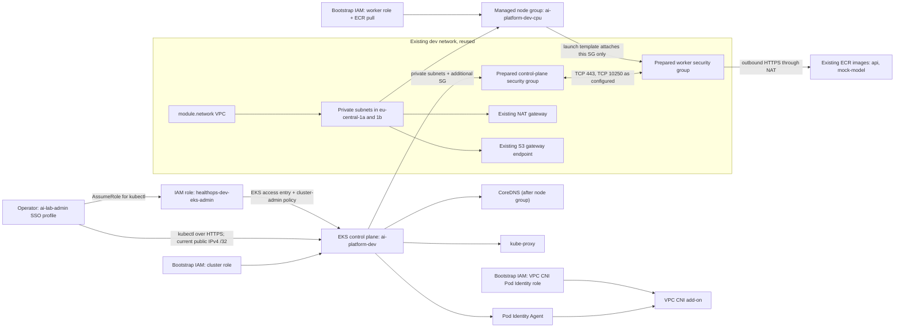
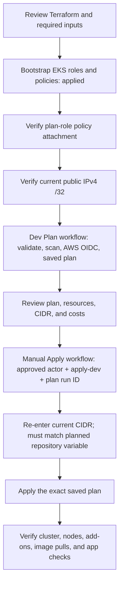

# HealthOps EKS: configuration, mapping, and workflow

**Status checked 8 October 2026:** Bootstrap created the EKS service roles and
scoped plan/apply policies. The `ai-platform-dev` cluster is `ACTIVE`; the
Pod Identity Agent and kube-proxy add-ons are present. The first dev apply
stopped while creating the VPC CNI Pod Identity association. VPC CNI, CoreDNS,
and the CPU node group are not present, so the cluster is not ready for
application workloads. The missing apply-role permission has since been added
through bootstrap and verified, but the dev apply has not been retried.

For deployment commands, troubleshooting, and post-deployment acceptance
checks, see [the EKS deployment guide](../../../../docs/eks-deployment.md).

## Short summary

This milestone adds an EKS cluster named `ai-platform-dev`, one small
On-Demand x86 CPU managed node group, EKS administrator access, and managed
networking add-ons. It reuses the development VPC, private subnets,
security groups, NAT gateway, S3 gateway endpoint, and ECR repositories.
Bootstrap Terraform has created the cluster/node/CNI IAM roles and the narrowly
scoped Terraform plan/apply policies. GitHub Actions can validate and plan;
applying the dev cluster remains a separate, manually approved step.

No Argo CD, Karpenter, Airflow, monitoring stack, GPU workers, or public
application load balancer is included.

## Kubernetes concepts in this configuration

| Term | Meaning here |
|---|---|
| Cluster | The EKS control plane plus the worker compute and Kubernetes add-ons. |
| Control plane | AWS-managed Kubernetes API, scheduler, controllers, and etcd. It stores and reconciles Kubernetes state; it does not run the application pods. |
| Node | An EC2 worker that runs kubelet, containerd, and pods. This milestone proposes a managed node group with one desired node. |
| Pod | Kubernetes' schedulable unit, normally running an application container. The API and mock-model can be deployed as pods in a later application rollout. |
| Container image | The packaged application. Existing API and mock-model images are in ECR; workers need IAM permissions and network connectivity to pull them. |
| Add-on | An AWS-managed Kubernetes component installed into the cluster. VPC CNI provides pod networking; CoreDNS resolves cluster names; kube-proxy forwards Service traffic; Pod Identity Agent lets selected pods obtain AWS credentials. |
| Service | A stable in-cluster address for selected pods. Application Services are not created in this infrastructure milestone. |
| EKS access entry | Associates an IAM principal with a Kubernetes access policy. It controls Kubernetes API authorization; AWS login alone is not cluster-admin access. |

## Architecture and relationships



The cluster uses `module.network` outputs, not fixed subnet or security-group
IDs. Workers receive private addresses only. NAT provides outbound access; it
does not grant AWS API permissions.

## IP address ranges: nodes, pods, and Services

There are two different address systems in this cluster. Do not confuse a
Kubernetes Service IP with an IP assigned to an EC2 instance or pod.

| Address / range | Comes from | Used for |
|---|---|---|
| VPC `10.40.0.0/16` | Existing VPC configuration | Address space for VPC resources. |
| Private subnet A `10.40.16.0/20` | Existing network module | Private IPs for worker ENIs and, with the AWS VPC CNI's default IPv4 mode, pod network interfaces/IPs. |
| Private subnet B `10.40.32.0/20` | Existing network module | Same as subnet A, in the second Availability Zone. |
| Kubernetes Service range `172.20.0.0/16` | Selected by AWS when this EKS cluster was created; not explicitly set in Terraform | Virtual `ClusterIP` addresses for Kubernetes Services, including the internal DNS Service. These addresses are not assigned to EC2 ENIs and are not routable VPC subnet addresses. |
| Pod IP | Allocated by AWS VPC CNI from VPC subnet capacity | Direct network address used by a pod. With the current VPC CNI setup, node and pod addresses consume private subnet IP capacity. |
| Service `ClusterIP` | Allocated by Kubernetes from `172.20.0.0/16` | Stable virtual destination. `kube-proxy` forwards Service traffic to the current ready pod IPs behind it. |

The VPC CNI means **Container Network Interface**, not VPN. It is the
Kubernetes networking plugin that obtains and manages VPC addresses for pod
networking through the worker's network interfaces. It is not a tunnel or a
remote-access VPN. The VPN component in this design is **none**; administrators
currently reach the public EKS API endpoint from the configured public IPv4
`/32`.

The Service range is separate from both VPC subnets. The cluster currently
reports `172.20.0.0/16`; it was not declared using a `service_ipv4_cidr`
Terraform argument. AWS chose it at cluster creation. It does not change when
a pod restarts or a Service is recreated; individual Service IPs may be newly
allocated when Services are recreated. The cluster's Service range is a
cluster-creation network choice, not a range to change as part of ordinary
updates. Avoid overlap with the VPC and networks that need to connect to the
cluster.

Check the cluster's live Service range with:

```powershell
aws eks describe-cluster `
  --name ai-platform-dev `
  --region eu-central-1 `
  --profile ai-lab-admin `
  --query "cluster.kubernetesNetworkConfig.serviceIpv4Cidr" `
  --output text
```

## DNS: CoreDNS versus public DNS

CoreDNS is planned as a DNS server running **inside Kubernetes**; it is not
installed in the current partial deployment. Once the node group and CoreDNS
add-on are healthy, pods use it to resolve Kubernetes Service names. In the
checked-in application manifests, the mock Service is named `mock-model` in
namespace `ai-platform`. The API uses the short name `mock-model` because both
work in the same namespace; its full DNS name is
`mock-model.ai-platform.svc.cluster.local`. CoreDNS resolves that name to the
Service's `ClusterIP` in the Service range. Traffic to that virtual IP is then
forwarded by `kube-proxy` to a ready mock-model pod's VPC CNI pod IP. The
Service name stays stable when pods are replaced and their IPs change.

CoreDNS also forwards DNS queries for names outside the Kubernetes cluster to
the configured upstream resolver (normally the VPC-provided resolver). This
lets pods resolve external names such as ECR or public internet domains; it
does not publish the application to the internet.

Public DNS for a human using HealthOps is a separate layer. Later, a domain
record at a DNS provider/registrar would point the application name to an
internet-facing load balancer or other approved ingress. A browser resolves
that public record and connects to the application ingress, which routes to
the API Service and its pods. This milestone creates **no public application
load balancer or public application DNS record**. The EKS API endpoint is
separate again: it has an AWS-provided DNS name used by `kubectl`, protected by
the configured administrator `/32`; it is not the HealthOps application
domain and is not resolved by CoreDNS on the operator's laptop.

```text
INTERNAL: API pod
  -> calls http://mock-model:8002 (same namespace: ai-platform)
  -> CoreDNS resolves mock-model to the mock-model Service ClusterIP (172.20.x.x)
  -> kube-proxy forwards TCP 8002 to a ready mock-model pod IP (10.40.x.x)

EXTERNAL APPLICATION (future; not created here): User browser
  -> public DNS/registrar record for the HealthOps domain
  -> public application load balancer
  -> API Service (secure-ai-api:8000; currently ClusterIP only)
  -> API pod (container listens on 8000)

ADMINISTRATION: Operator laptop
  -> AWS SSO / assumed EKS admin role
  -> AWS EKS API endpoint DNS name over HTTPS
  -> public endpoint allows only the configured administrator /32
```

## What is configured

| Area | Configuration |
|---|---|
| Cluster | `ai-platform-dev`, Kubernetes `1.35`; access mode `API`; cluster-creator bootstrap admin disabled. |
| Kubernetes API reachability | Private endpoint enabled for in-VPC clients; public endpoint enabled only for the required, explicitly supplied administrator IPv4 `/32`. Reconfirm that address before a plan and again before an apply. |
| Cluster logs | API, audit, authenticator, controller-manager, and scheduler logs; CloudWatch retention 30 days. CloudWatch encrypts logs at rest by default. |
| CPU workers | Managed node group in both existing private subnets; On-Demand `t3.medium` x86_64; Amazon Linux 2023; desired/min/max `1/1/2`; no SSH key or public IP. |
| Worker launch template | Prepared worker SG only; IMDSv2 required; encrypted 30-GiB gp3 root volume; instance and volume tags set. |
| Add-ons | Terraform resolves the newest AWS-compatible versions for the configured Kubernetes version at plan time. Pod Identity Agent, VPC CNI, and kube-proxy are prerequisites for the node group; CoreDNS depends on the node group. |
| VPC CNI identity | Dedicated Pod Identity association for service account `aws-node` and the bootstrap-managed CNI role, attached to `AmazonEKS_CNI_Policy`. |
| Administrator | Access entry for `healthops-dev-eks-admin`, associated with `AmazonEKSClusterAdminPolicy` at cluster scope. |
| Not included | Application Kubernetes manifests, Argo CD, autoscaler/Karpenter, GPU nodes, Airflow, observability stack, public application ingress/load balancer. |

`t3.medium` provides 2 vCPU and 4 GiB RAM. It is a starting point for the
API/mock-model learning baseline, not a capacity guarantee. Consider
`t3.large` (8 GiB) if the workloads and system pods cause memory pressure.
One desired node is cost-conscious, not highly available. A maximum of two
only sets an upper bound; it does not turn on automatic node scaling.

Kubernetes 1.28 and later use EKS default envelope encryption for Kubernetes
API data with an AWS-owned KMS key. This configuration does not add a
customer-managed cluster key. The 30-day log retention is a development cost
choice, not the production baseline.

## Terraform configuration map

| File | Responsibility |
|---|---|
| [dev environment main.tf](../../environments/dev/main.tf) | Instantiates `module.network`, ECR, and `module.eks`; passes network module outputs and reads the three EKS service roles by name. |
| [dev variables.tf](../../environments/dev/variables.tf) | Requires account, document bucket, administrator role ARN, and current public `/32`; defines Kubernetes version and node size defaults. |
| [EKS module main.tf](./main.tf) | Creates the log group, EKS cluster, add-on version lookups/add-ons, CPU launch template and node group, and admin access module. |
| [EKS module variables.tf](./variables.tf) | Defines the module contract for networking, security groups, role ARNs, administrator input, node sizing, logging, and tags. |
| [EKS module outputs.tf](./outputs.tf) | Exposes cluster name, endpoint, AWS-managed cluster security-group ID, and CPU node-group name. |
| [eks-admin-access module](../eks-admin-access/main.tf) | Creates the administrator access entry and cluster-scoped EKS administrator policy association. |
| [bootstrap EKS roles](../../bootstrap/eks_workload_roles.tf) | Defines the control-plane, worker, and VPC CNI IAM roles and their AWS-managed permissions; applied on 6 October 2026. |
| [bootstrap managed policies](../../bootstrap/managed_policies.tf) | Defines EKS plan-read and apply policies and attaches them to the existing Terraform roles; created on 6 October and updated on 8 October 2026. |
| [EKS apply policy](../../bootstrap/policies/managed/eks-apply.json) | Scopes create/update/delete permissions to this cluster and its named resources; scopes `iam:PassRole` to the three EKS service roles and their services. |
| [EKS plan policy](../../bootstrap/policies/managed/eks-plan-read.json) | Provides read-only discovery of EKS, launch-template, log-group, subnet/security-group, and role information needed for planning. |
| [Terraform plan workflow](../../../../.github/workflows/terraform-plan.yml) | Formats, validates, scans, authenticates with AWS OIDC, generates a saved plan, and publishes the plan artifact. It does not apply. |
| [Terraform apply workflow](../../../../.github/workflows/terraform-apply.yml) | Validates explicit approval and a recent successful `main` plan, downloads that plan, checks its integrity, reconfirms the admin CIDR for EKS changes, and applies the saved plan. |

The bootstrap roles are separate from the operator role:

| IAM identity | Used by | Permission relationship |
|---|---|---|
| `healthops-dev-eks-cluster` | EKS control plane | Trusts `eks.amazonaws.com`; attached `AmazonEKSClusterPolicy`. |
| `healthops-dev-eks-workers` | EC2 worker nodes | Trusts `ec2.amazonaws.com`; attached `AmazonEKSWorkerNodePolicy` and `AmazonEC2ContainerRegistryPullOnly`. |
| `healthops-dev-eks-vpc-cni` | VPC CNI add-on through Pod Identity | Trusts `pods.eks.amazonaws.com`; attached `AmazonEKS_CNI_Policy`. |
| `healthops-dev-eks-admin` | Human operator running `kubectl` | Assumed from the `ai-lab-admin` SSO profile; EKS access entry grants Kubernetes cluster-admin, not broad AWS administrator access. |
| Terraform plan role | GitHub plan job | Read-only EKS planning policy plus existing read policies. |
| Terraform apply role | GitHub apply job | Scoped resource-management policy and `iam:PassRole` for only the EKS service roles. |

The apply policy now grants the VPC CNI add-on's required Pod Identity
association operations, scoped to this cluster and its association resources.
This policy update was applied on 8 October 2026 and verified with IAM policy
simulation. The apply workflow validates the current administrator CIDR
against both the saved plan and repository variable; it does not override
inputs embedded in a Terraform saved plan.

The `healthops-dev-eks-admin` role trust must remain limited to the verified
AWS IAM Identity Center administrator role. Do not replace its SSO principal
with a guessed or newly named role ARN.

## Security group ownership and traffic

The cluster's `vpc_config` supplies the prepared additional control-plane
security group. EKS also creates and attaches its AWS-managed cluster
security group to control-plane interfaces. The node group's launch template
supplies **only** the prepared worker security group; custom security groups
in that launch template suppress automatic attachment of the AWS-managed
cluster security group to worker instances. This is intentional.

| Connection | Existing standalone rule path |
|---|---|
| Worker to Kubernetes API | Worker SG egress TCP 443 to the control-plane SG; control-plane SG ingress TCP 443 from worker SG. |
| Control plane to worker kubelet/webhooks | Control-plane SG egress TCP 10250 and TCP 443 to worker SG; worker SG ingress from control-plane SG on those ports. |
| Node and pod traffic within workers | Worker SG self-referencing all-protocol ingress and egress. |
| Worker DNS | Worker SG egress TCP and UDP 53 to the VPC CIDR. |
| Worker AWS/ECR/external HTTPS | Worker SG egress TCP 443; private route sends internet-bound traffic through existing NAT. |

These rules remain owned by standalone
`aws_vpc_security_group_ingress_rule` and
`aws_vpc_security_group_egress_rule` resources in the network module. The EKS
module does not manage inline ingress or egress. Review the plan for unexpected
security-group rule changes before applying.

## Configuration and deployment workflow



1. Configure GitHub repository variables `EKS_ADMIN_IAM_ROLE_ARN` and
   `EKS_ADMIN_PUBLIC_IPV4_CIDR`. The ARN is
   `arn:aws:iam::429496640190:role/healthops-dev-eks-admin`; the CIDR must be
   the administrator's current IPv4 address with `/32`. Any previously
   recorded CIDR is historical and must not be assumed current.
2. Confirm that `healthops-dev-eks-plan-read` is attached to
   `healthops-dev-terraform-plan-permissions`. The EKS roles and policy
   attachments were created by bootstrap on 6 October 2026. Pod Identity
   association permissions were added to the managed policies on 8 October
   2026. If the attachment is missing or future bootstrap changes are needed,
   review a new bootstrap plan and apply only after confirming its changes.
3. Run the Terraform Plan workflow. It performs formatting, validation, Trivy
   and Checkov scans, authenticates to AWS using GitHub OIDC, and saves the
   Terraform plan artifact. It does **not** apply infrastructure.
4. Review the saved plan. Confirm it reuses the current VPC outputs and
   security groups, proposes only expected EKS resources, contains the
   confirmed administrator `/32`, and has no unexpected replacements,
   deletions, or network rule changes.
5. Run the protected manual Terraform Apply workflow from `main`, provide the
   successful plan run ID, type `apply-dev`, and re-enter the current CIDR
   when the plan creates or changes the cluster. The workflow accepts only a
   recent successful plan for the current `main` commit and requires the
   entered CIDR to match the repository variable. A changed IP requires
   updating the variable and generating a new plan.
6. After an approved deployment, use the operator role to verify the cluster,
   node group, worker readiness, add-on health, ECR pulls, and application
   connectivity. The resources are not considered deployed or verified until
   these checks pass.

For local operations, use AWS SSO and the named role profile described in
[the deployment guide](../../../../docs/eks-deployment.md#administrator-access).
The role chain is:

```text
AWS IAM Identity Center profile ai-lab-admin
    -> assumes IAM role healthops-dev-eks-admin
    -> AWS CLI obtains an EKS token for kubectl
    -> EKS access entry authorizes cluster-scoped administrator actions
```

Never apply an old or stale plan. Generate a fresh plan after changes to
Terraform state, source configuration, administrator CIDR, or bootstrap
permissions.

## Verification after deployment

These are acceptance targets, not current results:

1. EKS reports cluster status `ACTIVE`.
2. Managed node group reports status `ACTIVE`.
3. `kubectl get nodes` shows the expected worker as `Ready`.
4. VPC CNI, CoreDNS, kube-proxy, and Pod Identity Agent are healthy.
5. A test workload pulls an existing image from ECR.
6. API and mock-model health checks pass and their internal communication
   works when application manifests are deployed.

Use [the deployment guide](../../../../docs/eks-deployment.md) for exact
PowerShell commands, troubleshooting, cleanup ordering, and remaining-resource
checks.
