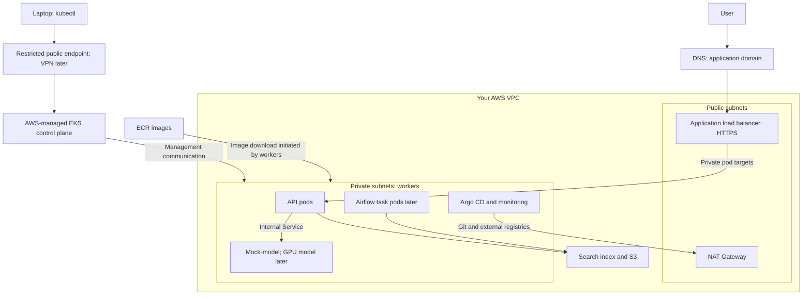
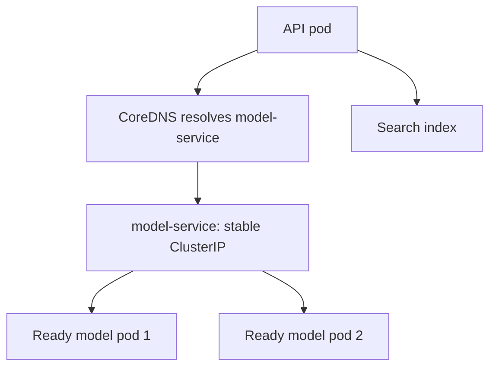
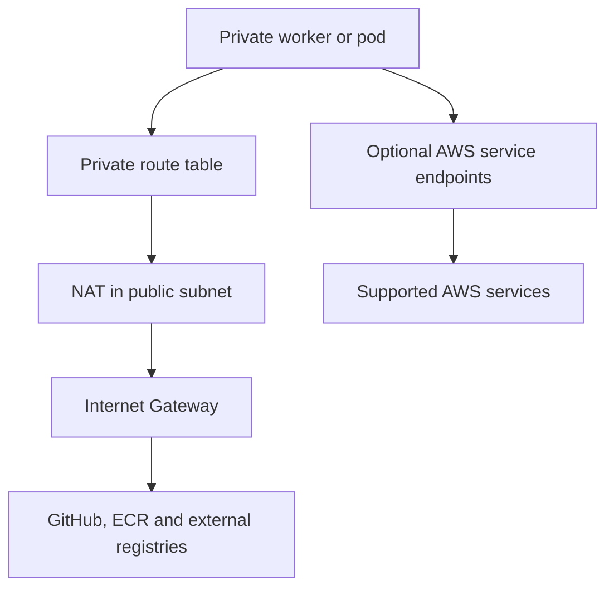
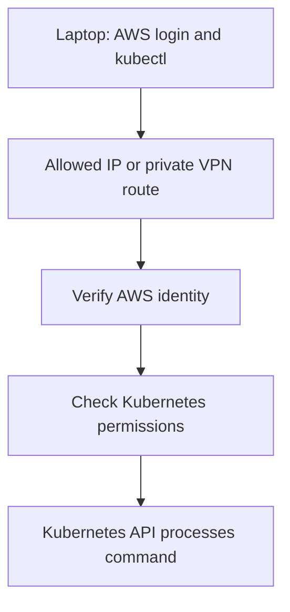
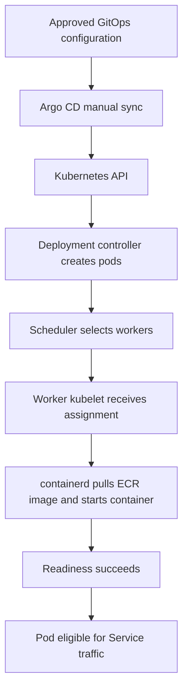

# HealthOps — EKS Architecture and Workflow Guide

Date: 4 October 2026. Status: proposed design, not a deployed or verified cluster.

The application images have been published to ECR. The next milestone is connectivity preparation, followed by EKS and CPU workers. Reuse existing infrastructure after inspecting it; the diagrams below describe the target design.

## 1. Scenario and purpose

A user asks HealthOps a question about a hospital policy. The API retrieves relevant document sections, calls the model service and returns an answer.

Kubernetes runs the containers, selects servers for them, maintains replica counts and connects components using stable service addresses.

- **Cluster:** the control plane plus worker nodes and supporting components.
- **Control plane:** manages desired state and scheduling; AWS manages it in EKS.
- **Node:** an EC2 server running workloads.
- **Pod:** the smallest scheduled workload unit, usually one application container in this project.
- **Image:** the packaged application stored in ECR.
- **Service:** a stable network address for a changing set of pods.

## 2. Target architecture

- Public subnets host the internet-facing load balancer and NAT Gateway.
- Private subnets host workers without public IP addresses.
- AWS hosts the managed control plane and provides connections into the customer VPC.
- Administrator access and user-facing application access are separate paths.
- Initial testing can use `kubectl port-forward`; the public application load balancer is a later milestone.

## 3. Control-plane components

| Component | Function | HealthOps example |
|---|---|---|
| API server | Receives Kubernetes requests and checks access | Accepts a Deployment requesting two API replicas |
| etcd | Stores cluster configuration and state | Stores Deployment and Service definitions |
| Scheduler | Assigns unscheduled pods to suitable nodes | Chooses a CPU worker with available requested capacity |
| Controllers | Reconcile actual state with desired state | Create a replacement pod when one disappears |

AWS manages these components in EKS. etcd is not the application database or document store.

## 4. Worker components

| Component | Function |
|---|---|
| kubelet | Receives pod assignments, starts them through the runtime and reports status |
| containerd | Downloads images and runs containers |
| AWS VPC CNI | Provides pod networking, normally using VPC IP addresses |
| kube-proxy | Implements Service forwarding in this standard design |
| Pods | Run API, model and platform containers |

A worker can run multiple pods if their requested resources fit. Later GPU workers need appropriate drivers/device support, and model pods must request GPU resources.

## 5. Kubernetes resources

| Resource | Purpose | Project example |
|---|---|---|
| Namespace | Groups resources and scopes access | `healthops-dev` |
| Deployment | Manages replicas and application rollouts | API and mock-model Deployments |
| Pod | Runs containers | One FastAPI instance |
| Service | Stable access to backing pods | `model-service` |
| Ingress | Declares incoming HTTP routing | Route application traffic to API |
| ConfigMap | Non-secret configuration | Model-service URL |
| Secret | Sensitive configuration | Credentials with restricted access |
| ServiceAccount | Workload identity inside Kubernetes | API service account |
| PersistentVolumeClaim | Requests persistent storage | Monitoring data or lab database volume |
| NetworkPolicy | Restricts permitted pod traffic | Allow API-to-model traffic |
| ResourceQuota | Limits namespace resource consumption | Dev CPU and memory budget |

A Deployment creates pods. A Service gives callers a stable address for those pods. A namespace alone does not enforce network isolation.

## 6. External network: user to API

1. User requests the HealthOps domain.
2. DNS resolves it to the application load balancer.
3. The load balancer accepts HTTPS with an ACM certificate.
4. Its routing rules select the API backend.
5. With ALB IP target mode, traffic goes directly to eligible API pod IPs in private subnets.
6. The API authenticates and authorizes the user, then processes the request.

The **AWS Load Balancer Controller** runs inside EKS. It reads Ingress configuration and creates/configures the ALB and related AWS resources. Ingress is configuration, not the load balancer itself. A Kubernetes Service describes the backend, but ALB IP-target traffic does not traverse its ClusterIP.

Service types:

| Type | Role | Use here |
|---|---|---|
| ClusterIP | Internal stable virtual address | API and model internal Services |
| NodePort | Exposes a port on nodes | Not needed for the proposed ALB IP-target application path |
| LoadBalancer | Requests external load-balancer integration | Optional for suitable workloads; commonly an NLB with AWS controller configuration |

Use ClusterIP Services and an ALB Ingress for the proposed HTTP application design.

## 7. Internal network: API to model

1. Configure the API with `http://model-service.healthops-dev.svc.cluster.local:<model-port>`.
2. CoreDNS resolves the Service name.
3. Service forwarding sends the connection to an eligible backend pod.
4. The model returns its result.
5. If a model pod is replaced, endpoint records update while the Service name stays stable.

| Element | Role |
|---|---|
| CoreDNS | Service-name resolution |
| ClusterIP | Stable virtual Service address |
| EndpointSlices | Record backend pod addresses and readiness |
| AWS VPC CNI | Underlying pod connectivity |
| NetworkPolicy | Enforced restrictions between selected workloads |

Keep the model Service internal. Plan node/pod subnet IP capacity and a non-overlapping Kubernetes Service address range before cluster creation.

## 8. Outbound network: workers to required services

Workers initiate image downloads; Argo CD reads Git; workloads reach AWS services.

Initial lab routes:

| Route table | Destination | Target |
|---|---|---|
| Public | VPC network | Local route |
| Public | `0.0.0.0/0` | Internet Gateway |
| Private worker | VPC network | Local route |
| Private worker | `0.0.0.0/0` | NAT Gateway |

NAT enables outbound connections without making private workers publicly reachable. It does not grant service permissions.

For private ECR downloads without NAT, the endpoint design normally needs `ecr.api`, `ecr.dkr` and an S3 gateway endpoint, private DNS, appropriate endpoint policies and security rules. Other services need their own connectivity. ECR endpoints do not provide general access to GitHub or external registries.

One NAT Gateway may simplify a lab, but creates an availability dependency and can introduce cross-zone transfer costs. A production design normally considers per-zone egress and its cost. Choose after inspecting the existing network.

## 9. Administrator access

Initial lab configuration:

- Enable private Kubernetes API access for workers and in-VPC controllers.
- Enable public Kubernetes API access only from an explicitly supplied administrator public IPv4 `/32`.
- Configure an EKS access entry for the administrator IAM role and appropriate Kubernetes permissions.
- Update the allowed address when the home internet public IP changes.
- Do not use the router's local `192.168.x.x` address or default to unrestricted public access.

Future production design: authenticated VPN → private routing and DNS → private-only Kubernetes endpoint. Verify the complete private path and permissions before disabling public access.

An EKS AWS management API interface endpoint is not the Kubernetes API endpoint and does not by itself provide `kubectl` access. AWS login alone does not grant cluster administration rights.

## 10. Deployment workflow

1. GitHub Actions tests, scans and publishes images to ECR.
2. A GitOps pull request selects the image digest for dev.
3. Review, merge and manually sync Argo CD.
4. Kubernetes starts the requested replicas and evaluates readiness.
5. Run smoke tests.
6. Promote the same digest to test and production practice, with approvals and manual sync.

Image publishing does not itself deploy. Terraform manages AWS resources and initial Argo CD bootstrap; Argo CD then manages application and platform configuration. Avoid overlapping resource ownership.

## 11. End-to-end request example

1. User sends a question over HTTPS.
2. ALB sends it to a ready API pod.
3. API validates the request and checks user access.
4. API retrieves relevant document sections from the search index.
5. API calls the internal model Service with the question and selected context.
6. Model generates a response.
7. API returns the response to the user.
8. Metrics record latency/errors; traces show timing across request stages.

Airflow runs a separate background workflow: S3 documents → text extraction → sections → embeddings → search-index update. It is not part of each interactive `/ask` request.

## 12. Security by boundary

| Boundary | Control | Purpose |
|---|---|---|
| Administrator network | Restricted endpoint or VPN | Limit API reachability |
| Administrator identity | AWS identity, EKS access entry and Kubernetes permissions | Authorize commands |
| Internet to application | HTTPS, ALB security group, WAF later | Protect inbound application traffic |
| User to API | Application authentication and authorization | Restrict HealthOps access |
| Worker to ECR | Worker IAM role with pull permissions | Download images |
| Pod to AWS | Dedicated role via EKS Pod Identity or service-account roles | Limit workload AWS permissions |
| Pod to pod | NetworkPolicies with a supporting enforcement engine | Restrict workload traffic |
| Container runtime | Non-root user, limited privileges and resource settings | Reduce privileges and control consumption |
| Credentials | Managed secrets, encryption and restricted read access | Protect sensitive values |

Initial network policy intent:

- Default-deny workload ingress/egress where appropriate, then explicitly allow required flows.
- Allow DNS queries to cluster DNS.
- Allow ALB-to-API traffic through applicable AWS security rules and pod policy configuration.
- Allow API-to-model traffic on the configured model port.
- Allow necessary search/storage and other outbound dependencies.
- Separate environment credentials, workload identities and data.

Kubernetes Secrets are not protected simply by base64 encoding. Use configured encryption and access controls. Preserve required control-plane, node and system-component traffic when tightening rules.

## 13. Reliability and scaling

| Capability | Function |
|---|---|
| Readiness probe | Removes unready pods from normal Service routing |
| Liveness probe | Restarts containers judged unhealthy |
| Startup probe | Allows slow startup before other probes take effect |
| Resource requests | Inform scheduling and capacity decisions |
| Resource limits | Constrain usage; CPU throttling or memory termination can occur |
| Multiple replicas | Provide more application capacity and redundancy |
| Pod disruption budget | Limits supported voluntary disruptions |
| Horizontal Pod Autoscaler | Adjusts application replicas using configured metrics |
| Karpenter | Supplies suitable node capacity for pending pods and consolidates eligible capacity |

Karpenter does not increase API replicas. The pod autoscaler does not create EC2 machines. Accurate requests, limits and scaling budgets are required.

For a node failure, replacement/rescheduling requires healthy capacity and takes time. Two replicas on one node do not protect against that node failing. Production should spread suitable capacity and replicas across availability zones.

## 14. Storage and state

| Data | Proposed location | Consideration |
|---|---|---|
| Container images | ECR | Deploy immutable image digests |
| Documents | S3 | Separate environment access and retention |
| Search index | Backend selected in a later milestone | Decide persistence, access and backup |
| Airflow metadata | PostgreSQL | Persistent lab storage; managed production database |
| Monitoring data | Persistent volumes or managed backends | Define retention and capacity |
| Model weights | Model repository/S3 with optional cache | Plan download permissions, disk and startup time |

Pod-local data is not a durable application store. Persistent EBS volumes need EBS CSI integration and zone-aware scheduling. Model images and model weights can be separate artifacts.

## 15. Observability and platform tools

| Tool | Function |
|---|---|
| Argo CD | Apply Git configuration and report synchronization/health |
| Prometheus | Collect and store metrics |
| Grafana | Query monitoring backends and display dashboards |
| OpenTelemetry | Instrument requests and collect/forward telemetry |
| Trace backend such as Tempo | Store traces for investigation |
| Airflow | Schedule ingestion jobs, track task status and retries |
| Karpenter | Manage worker capacity |

Watch request failures, latency, pod restarts, node usage, pending pods and Airflow task failures. Keep Kubernetes events/container logs available; add a centralized log backend as a separate milestone. Enable appropriate EKS control-plane logging for audit and troubleshooting.

## 16. Build sequence and acceptance checks

| Stage | Build | Verify |
|---|---|---|
| 1 | Inspect network and prepare connectivity | Correct routes, DNS, roles and access inputs |
| 2 | EKS and initial CPU worker group | Workers Ready; administrator commands succeed |
| 3 | VPC CNI, CoreDNS and kube-proxy | Pod connectivity and Service DNS work |
| 4 | API and mock-model baseline | Images pull; probes and API-to-model tests pass |
| 5 | Argo CD | Approved Git configuration deploys by manual sync |
| 6 | Monitoring and security policies | Metrics/traces appear; allowed/denied flows behave as intended |
| 7 | External HTTPS path | Domain, certificate and ALB routing work |
| 8 | Karpenter | Pending test pods trigger capacity within limits |
| 9 | Airflow | Synthetic document is ingested; retries verified |
| 10 | GPU inference | GPU scheduling and real-model requests succeed |

One lab cluster can use `healthops-dev`, `healthops-test` and `healthops-prod` namespaces. Production practice uses synthetic data. A real production deployment should have a separate cluster/account security boundary.

Use the lab cycle: apply → learn/test/document → destroy. Verify leftover images, load balancers, storage and other chargeable resources. Do not describe a stage as verified until tested against deployed resources.

## 17. Official references

- [Kubernetes cluster architecture](https://kubernetes.io/docs/concepts/architecture/)
- [Kubernetes networking and Services](https://kubernetes.io/docs/concepts/services-networking/)
- [EKS VPC networking](https://docs.aws.amazon.com/eks/latest/best-practices/networking.html)
- [EKS network security](https://docs.aws.amazon.com/eks/latest/best-practices/network-security.html)
- [EKS ALB routing](https://docs.aws.amazon.com/eks/latest/userguide/alb-ingress.html)
- [EKS cluster API endpoint](https://docs.aws.amazon.com/eks/latest/userguide/cluster-endpoint.html)
- [ECR VPC endpoints](https://docs.aws.amazon.com/AmazonECR/latest/userguide/vpc-endpoints.html)
