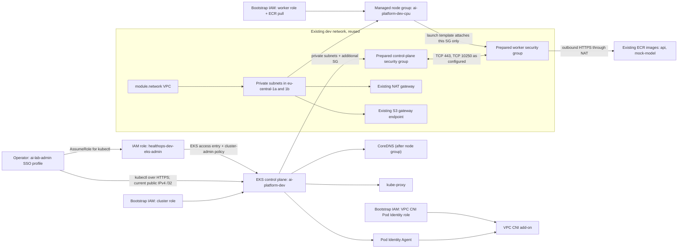
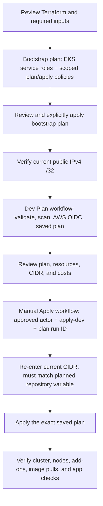

# HealthOps EKS: configuration, mapping, and workflow

**Status as of 6 October 2026:** Terraform and IAM configuration is prepared.
The EKS cluster, node group, and add-ons have not been deployed or verified.
This document describes the configuration in this repository, not a claim
that the AWS resources already exist.

For deployment commands, troubleshooting, and post-deployment acceptance
checks, see [the EKS deployment guide](../../../../docs/eks-deployment.md).

## Short summary

This milestone adds an EKS cluster named `ai-platform-dev`, one small
On-Demand x86 CPU managed node group, EKS administrator access, and managed
networking add-ons. It reuses the development VPC, private subnets,
security groups, NAT gateway, S3 gateway endpoint, and ECR repositories.
Bootstrap Terraform prepares the cluster/node/CNI IAM roles and the narrowly
scoped Terraform plan/apply policies. GitHub Actions can validate and plan;
applying remains a separate, manually approved step.

No Argo CD, Karpenter, Airflow, monitoring stack, GPU workers, or public
application load balancer is included.

## Kubernetes concepts in this configuration

| Term | Meaning here |
|---|---|
| Cluster | The EKS control plane plus the worker compute and Kubernetes add-ons. |
| Control plane | AWS-managed Kubernetes API, scheduler, controllers, and etcd. It stores and reconciles Kubernetes state; it does not run the application pods. |
| Node | An EC2 worker that runs kubelet, containerd, and pods. This milestone proposes a managed node group with one desired node. |
| Pod | Kubernetes' schedulable unit, normally running an application container. The API and mock-model can be deployed as pods in a later application rollout. |
| Container image | The packaged application. Existing API and mock-model images are in ECR; workers need IAM permissions and network connectivity to pull them. |
| Add-on | An AWS-managed Kubernetes component. This configuration manages VPC CNI, CoreDNS, kube-proxy, and the Pod Identity Agent. |
| Service | A stable in-cluster address for selected pods. Application Services are not created in this infrastructure milestone. |
| EKS access entry | Associates an IAM principal with a Kubernetes access policy. It controls Kubernetes API authorization; AWS login alone is not cluster-admin access. |

## Architecture and relationships



The cluster uses `module.network` outputs, not fixed subnet or security-group
IDs. Workers receive private addresses only. NAT provides outbound access; it
does not grant AWS API permissions.

## What is configured

| Area | Configuration |
|---|---|
| Cluster | `ai-platform-dev`, Kubernetes `1.35`; access mode `API`; cluster-creator bootstrap admin disabled. |
| Kubernetes API reachability | Private endpoint enabled for in-VPC clients; public endpoint enabled only for the required, explicitly supplied administrator IPv4 `/32`. Reconfirm that address before a plan and again before an apply. |
| Cluster logs | API, audit, authenticator, controller-manager, and scheduler logs; CloudWatch retention 30 days. CloudWatch encrypts logs at rest by default. |
| CPU workers | Managed node group in both existing private subnets; On-Demand `t3.medium` x86_64; Amazon Linux 2023; desired/min/max `1/1/2`; no SSH key or public IP. |
| Worker launch template | Prepared worker SG only; IMDSv2 required; encrypted 30-GiB gp3 root volume; instance and volume tags set. |
| Add-ons | Terraform resolves the newest AWS-compatible versions for the configured Kubernetes version at plan time. Pod Identity Agent, VPC CNI, and kube-proxy are prerequisites for the node group; CoreDNS depends on the node group. |
| VPC CNI identity | Dedicated Pod Identity association for service account `aws-node` and the bootstrap-managed CNI role, attached to `AmazonEKS_CNI_Policy`. |
| Administrator | Access entry for `healthops-dev-eks-admin`, associated with `AmazonEKSClusterAdminPolicy` at cluster scope. |
| Not included | Application Kubernetes manifests, Argo CD, autoscaler/Karpenter, GPU nodes, Airflow, observability stack, public application ingress/load balancer. |

`t3.medium` provides 2 vCPU and 4 GiB RAM. It is a starting point for the
API/mock-model learning baseline, not a capacity guarantee. Consider
`t3.large` (8 GiB) if the workloads and system pods cause memory pressure.
One desired node is cost-conscious, not highly available. A maximum of two
only sets an upper bound; it does not turn on automatic node scaling.

Kubernetes 1.28 and later use EKS default envelope encryption for Kubernetes
API data with an AWS-owned KMS key. This configuration does not add a
customer-managed cluster key. The 30-day log retention is a development cost
choice, not the production baseline.

## Terraform configuration map

| File | Responsibility |
|---|---|
| [dev environment main.tf](../../environments/dev/main.tf) | Instantiates `module.network`, ECR, and `module.eks`; passes network module outputs and reads the three EKS service roles by name. |
| [dev variables.tf](../../environments/dev/variables.tf) | Requires account, document bucket, administrator role ARN, and current public `/32`; defines Kubernetes version and node size defaults. |
| [EKS module main.tf](./main.tf) | Creates the log group, EKS cluster, add-on version lookups/add-ons, CPU launch template and node group, and admin access module. |
| [EKS module variables.tf](./variables.tf) | Defines the module contract for networking, security groups, role ARNs, administrator input, node sizing, logging, and tags. |
| [EKS module outputs.tf](./outputs.tf) | Exposes cluster name, endpoint, AWS-managed cluster security-group ID, and CPU node-group name. |
| [eks-admin-access module](../eks-admin-access/main.tf) | Creates the administrator access entry and cluster-scoped EKS administrator policy association. |
| [bootstrap EKS roles](../../bootstrap/eks_workload_roles.tf) | Prepares the control-plane, worker, and VPC CNI IAM roles and attaches their AWS-managed permissions. |
| [bootstrap managed policies](../../bootstrap/managed_policies.tf) | Defines and attaches EKS plan-read and apply policies to the existing Terraform roles. |
| [EKS apply policy](../../bootstrap/policies/managed/eks-apply.json) | Scopes create/update/delete permissions to this cluster and its named resources; scopes `iam:PassRole` to the three EKS service roles and their services. |
| [EKS plan policy](../../bootstrap/policies/managed/eks-plan-read.json) | Provides read-only discovery of EKS, launch-template, log-group, subnet/security-group, and role information needed for planning. |
| [Terraform plan workflow](../../../../.github/workflows/terraform-plan.yml) | Formats, validates, scans, authenticates with AWS OIDC, generates a saved plan, and publishes the plan artifact. It does not apply. |
| [Terraform apply workflow](../../../../.github/workflows/terraform-apply.yml) | Validates explicit approval and a recent successful `main` plan, downloads that plan, checks its integrity, reconfirms the admin CIDR for EKS changes, and applies the saved plan. |

The bootstrap roles are separate from the operator role:

| IAM identity | Used by | Permission relationship |
|---|---|---|
| `healthops-dev-eks-cluster` | EKS control plane | Trusts `eks.amazonaws.com`; attached `AmazonEKSClusterPolicy`. |
| `healthops-dev-eks-workers` | EC2 worker nodes | Trusts `ec2.amazonaws.com`; attached `AmazonEKSWorkerNodePolicy` and `AmazonEC2ContainerRegistryPullOnly`. |
| `healthops-dev-eks-vpc-cni` | VPC CNI add-on through Pod Identity | Trusts `pods.eks.amazonaws.com`; attached `AmazonEKS_CNI_Policy`. |
| `healthops-dev-eks-admin` | Human operator running `kubectl` | Assumed from the `ai-lab-admin` SSO profile; EKS access entry grants Kubernetes cluster-admin, not broad AWS administrator access. |
| Terraform plan role | GitHub plan job | Read-only EKS planning policy plus existing read policies. |
| Terraform apply role | GitHub apply job | Scoped resource-management policy and `iam:PassRole` for only the EKS service roles. |

The `healthops-dev-eks-admin` role trust must remain limited to the verified
AWS IAM Identity Center administrator role. Do not replace its SSO principal
with a guessed or newly named role ARN.

## Security group ownership and traffic

The cluster's `vpc_config` supplies the prepared additional control-plane
security group. EKS also creates and attaches its AWS-managed cluster
security group to control-plane interfaces. The node group's launch template
supplies **only** the prepared worker security group; custom security groups
in that launch template suppress automatic attachment of the AWS-managed
cluster security group to worker instances. This is intentional.

| Connection | Existing standalone rule path |
|---|---|
| Worker to Kubernetes API | Worker SG egress TCP 443 to the control-plane SG; control-plane SG ingress TCP 443 from worker SG. |
| Control plane to worker kubelet/webhooks | Control-plane SG egress TCP 10250 and TCP 443 to worker SG; worker SG ingress from control-plane SG on those ports. |
| Node and pod traffic within workers | Worker SG self-referencing all-protocol ingress and egress. |
| Worker DNS | Worker SG egress TCP and UDP 53 to the VPC CIDR. |
| Worker AWS/ECR/external HTTPS | Worker SG egress TCP 443; private route sends internet-bound traffic through existing NAT. |

These rules remain owned by standalone
`aws_vpc_security_group_ingress_rule` and
`aws_vpc_security_group_egress_rule` resources in the network module. The EKS
module does not manage inline ingress or egress. Review the plan for unexpected
security-group rule changes before applying.

## Configuration and deployment workflow



1. Configure GitHub repository variables `EKS_ADMIN_IAM_ROLE_ARN` and
   `EKS_ADMIN_PUBLIC_IPV4_CIDR`. The ARN is
   `arn:aws:iam::429496640190:role/healthops-dev-eks-admin`; the CIDR must be
   the administrator's current IPv4 address with `/32`. The previously used
   `195.14.217.35/32` is historical and must not be assumed current.
2. Review and apply bootstrap changes first. The dev plan reads the
   bootstrap-managed roles and needs the updated plan policy. Use the existing
   bootstrap approval process and inspect its saved plan before applying.
3. Run the Terraform Plan workflow. It performs formatting, validation, Trivy
   and Checkov scans, authenticates to AWS using GitHub OIDC, and saves the
   Terraform plan artifact. It does **not** apply infrastructure.
4. Review the saved plan. Confirm it reuses the current VPC outputs and
   security groups, proposes only expected EKS resources, contains the
   confirmed administrator `/32`, and has no unexpected replacements,
   deletions, or network rule changes.
5. Run the protected manual Terraform Apply workflow from `main`, provide the
   successful plan run ID, type `apply-dev`, and re-enter the current CIDR
   when the plan creates or changes the cluster. The workflow accepts only a
   recent successful plan for the current `main` commit and requires the
   entered CIDR to match the repository variable. A changed IP requires
   updating the variable and generating a new plan.
6. After an approved deployment, use the operator role to verify the cluster,
   node group, worker readiness, add-on health, ECR pulls, and application
   connectivity. The resources are not considered deployed or verified until
   these checks pass.

For local operations, use AWS SSO and the named role profile described in
[the deployment guide](../../../../docs/eks-deployment.md#administrator-access).
The role chain is:

```text
AWS IAM Identity Center profile ai-lab-admin
    -> assumes IAM role healthops-dev-eks-admin
    -> AWS CLI obtains an EKS token for kubectl
    -> EKS access entry authorizes cluster-scoped administrator actions
```

Never apply an old or stale plan. Generate a fresh plan after changes to
Terraform state, source configuration, administrator CIDR, or bootstrap
permissions.

## Verification after deployment

These are acceptance targets, not current results:

1. EKS reports cluster status `ACTIVE`.
2. Managed node group reports status `ACTIVE`.
3. `kubectl get nodes` shows the expected worker as `Ready`.
4. VPC CNI, CoreDNS, kube-proxy, and Pod Identity Agent are healthy.
5. A test workload pulls an existing image from ECR.
6. API and mock-model health checks pass and their internal communication
   works when application manifests are deployed.

Use [the deployment guide](../../../../docs/eks-deployment.md) for exact
PowerShell commands, troubleshooting, cleanup ordering, and remaining-resource
checks.
