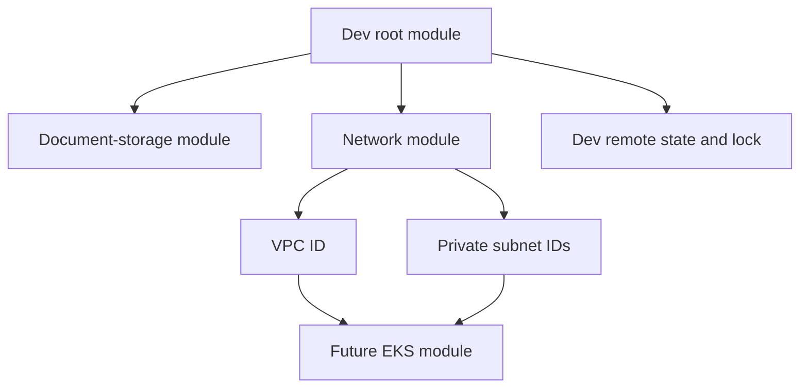
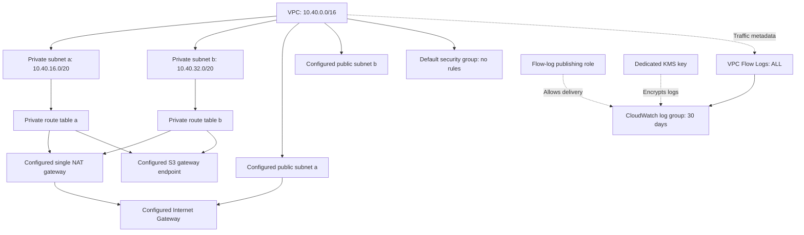
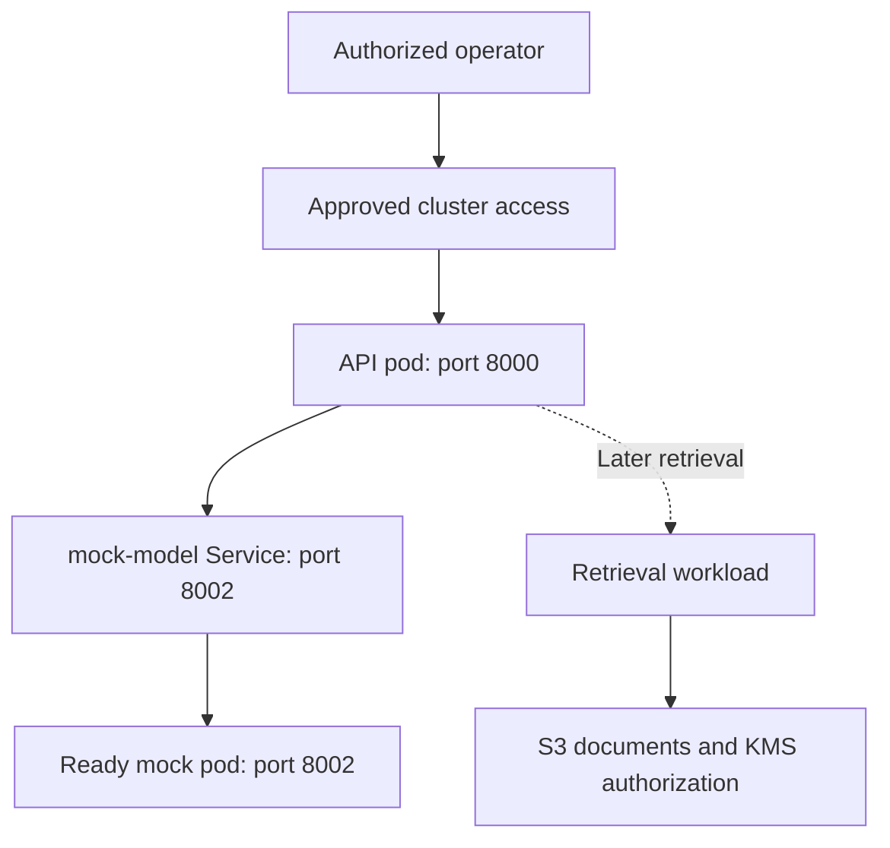

# Healthcare Operations & Resilience Assistant — Network Guide

Updated: 1 October 2026.

**Status: base network resources are recorded as created in AWS.** The supplied Terraform log confirms creation of all 13 base network resource addresses listed below. Read-only AWS checks confirmed the VPC, private subnets, DNS settings and current local-only private routes. No Internet Gateway, NAT Gateway, VPC endpoint, EKS cluster in `eu-central-1`, or running/pending EC2 instance in the private subnets was found. The current Terraform change adds public/NAT egress, an S3 endpoint and EKS security groups; these additions await the normal reviewed apply. Connectivity is not verified. See the [worker connectivity and administrator access guide](../../../../docs/eks-connectivity.md).

## Deployment record

Account: `429496640190` · Region: `eu-central-1` · Environment: `dev`.

| Resource | Terraform address (under `module.network`) | Created ID or name |
|---|---|---|
| VPC | `aws_vpc.this` | `vpc-0213b3c62cb94e86d` |
| Private subnet a | `aws_subnet.private["a"]` | `subnet-097a6504a725de799` |
| Private subnet b | `aws_subnet.private["b"]` | `subnet-0a520b845174e472e` |
| Route table a | `aws_route_table.private["a"]` | `rtb-091c63efd34c5a18a` |
| Route table b | `aws_route_table.private["b"]` | `rtb-0c6b58cab126ce6e1` |
| Association a | `aws_route_table_association.private["a"]` | `rtbassoc-0126c357f7b378360` |
| Association b | `aws_route_table_association.private["b"]` | `rtbassoc-00c7ce744421285d2` |
| Restricted default security group | `aws_default_security_group.restricted` | `sg-0f518fd8e71d3ded9` |
| Flow-log KMS key | `aws_kms_key.vpc_flow_logs` | `cb02006b-b487-4f4c-99cc-a793730fa11f` |
| Flow-log IAM role | `aws_iam_role.vpc_flow_logs` | `healthops-dev-vpc-flow-logs` |
| Inline publishing policy | `aws_iam_role_policy.vpc_flow_logs` | `healthops-dev-vpc-flow-logs-publish` |
| CloudWatch log group | `aws_cloudwatch_log_group.vpc_flow_logs` | `/aws/vpc/healthops-dev/flow-logs` |
| VPC flow log | `aws_flow_log.vpc` | `fl-0c3b93146cb0ca7e5` |

There are **13 managed resource addresses** in this table: the default security group is adopted and restricted by Terraform rather than independently created from scratch. The VPC automatically creates that default group. The creation log reports completion for these 13 addresses.

## 1. Goal and real scenario

Hospital IT asks: “CareRoster login is unavailable. Which approved recovery procedure applies?” The future application will receive the question, retrieve approved evidence, and return an answer with sources. The network provides controlled connections between the API, model service, document storage, and administrators.

Our AWS milestone starts with the existing API and mock model. Retrieval and real model inference are later application milestones. This development environment uses synthetic documents; it is not a production hospital system.

## 2. Root module versus repository root

The repository root is the top project folder. The Terraform root module is the directory selected when Terraform runs: `infrastructure/terraform/environments/dev`.

Terraform loads all `.tf` files in that directory together. `main.tf` and `network.tf` have no execution order or separate state merely because their names differ. Nested directories are not automatically loaded: a `module` block explicitly calls a child module. [1]

The current module call includes the two private subnets and two public /24
subnets. Public subnet `a` hosts the single lab NAT gateway; workers stay in
private subnets. This desired topology is pending apply. Recommended convention
for this project:

| Location | Responsibility |
|---|---|
| `environments/dev/main.tf` | Call document-storage, network, and later EKS modules |
| `environments/dev/providers.tf` | AWS region, credential configuration, account guard |
| `environments/dev/backend.tf` | S3 state location and locking |
| `environments/dev/variables.tf` | Environment inputs |
| `environments/dev/outputs.tf` | Values exposed to operators |
| `modules/network/main.tf` | VPC, subnets, route tables, NAT, S3 endpoint, associations and default security group |
| `modules/network/flow-logs.tf` | Flow log, encrypted log group, KMS key and publishing role |
| `modules/network/variables.tf` | Inputs accepted by the network module |
| `modules/network/outputs.tf` | VPC, subnet and route-table IDs |
| `modules/network/versions.tf` | Required AWS provider |

Keep module calls together in `dev/main.tf` while the project is small. If `dev/network.tf` already contains `module "network"`, move that block to `main.tf`; do not copy it and leave two declarations. The module address remains `module.network`, so moving the block between files in the same directory does not itself recreate resources.

Use separate root directories and state keys for dev, test and prd. The current dev root shares `dev/terraform.tfstate` across document storage and the deployed network. A full dev destroy would therefore cover both. Bootstrap state remains separate. Splitting network and applications into separate states can be considered later when ownership or lifecycle requirements justify it.

## 3. Root-module call

The existing call in `infrastructure/terraform/environments/dev/main.tf` is shown for reference. Do not add a second copy:

```hcl
# Create the development network from the reusable module.
module "network" {
  source = "../../modules/network"

  name     = "healthops-dev"
  vpc_cidr = "10.40.0.0/16"

  # Place private subnets in different Availability Zones.
  private_subnets = {
    a = {
      cidr_block        = "10.40.16.0/20"
      availability_zone = "eu-central-1a"
    }
    b = {
      cidr_block        = "10.40.32.0/20"
      availability_zone = "eu-central-1b"
    }
  }

  public_subnets = {
    a = {
      cidr_block        = "10.40.0.0/24"
      availability_zone = "eu-central-1a"
    }
    b = {
      cidr_block        = "10.40.1.0/24"
      availability_zone = "eu-central-1b"
    }
  }

  tags = {
    Project     = "healthcare-operations-assistant"
    Environment = "dev"
    ManagedBy   = "Terraform"
    Component   = "network"
    Owner       = "Ikteaja"
  }
}
```

The child module is reusable and provider configuration is inherited from the
root. Existing document-storage permissions do not automatically grant network
resource permissions. The new NAT resources are configured, not yet verified
as deployed; do not repeat the module call.

## 4. Terraform dependency mapping



| Value or reference | Meaning |
|---|---|
| `source = "../../modules/network"` | Resolve the child module relative to the dev directory |
| `var.vpc_cidr` | Receives the VPC address range supplied by dev |
| `for_each = var.private_subnets` | Creates resources with stable keys `a` and `b` |
| `aws_vpc.this.id` | Places subnets and route tables in the same VPC |
| `aws_subnet.private[each.key].id` | Selects the subnet matching a route-table association |
| `module.network.vpc_id` | Future EKS module input |
| `values(module.network.private_subnet_ids)` | Future list of EKS subnet IDs |

Terraform determines dependency order from references, not file order. Create explicit root outputs if operators need these values through `terraform output`.

## 5. Address plan and subnetting

VPC range: `10.40.0.0/16`, covering `10.40.0.0` through `10.40.255.255`.

A `/20` subnet contains 4,096 addresses. In a normal AWS IPv4 subnet, five addresses are reserved, leaving 4,091 assignable addresses. Assignable addresses are not equivalent to a guaranteed pod capacity: EKS networking, instance limits and other interfaces consume them. [2]

| Subnet | Zone | Range | Assignable range | Purpose |
|---|---|---|---|---|
| `a` | `eu-central-1a` | `10.40.16.0/20` | `10.40.16.4`–`10.40.31.254` | Future private workers and pods |
| `b` | `eu-central-1b` | `10.40.32.0/20` | `10.40.32.4`–`10.40.47.254` | Future private workers and pods |

The remaining VPC ranges are available. The current dev configuration reserves
`10.40.0.0/24` and `10.40.1.0/24` as public subnets for NAT/possible future
load-balancer infrastructure. They are configured in Terraform but are not
confirmed as deployed.

Confirm ranges do not overlap future connected hospital networks, VPN networks, or other VPCs. The supplied deployment log confirms subnet creation; verify their AZs using the commands below. Two subnets provide a foundation for availability; one worker node would still be a single point of failure. EKS requires at least two subnets in different AZs. [3]

## 6. Deployed foundation and pending egress topology



The base apply record lists no EKS nodes or cluster. NAT, public subnet, IGW and
S3 endpoint resources are in the current configuration but remain pending
reviewed apply. Private workers will have no public IP and no direct route to
the IGW. [3]

## 7. Routing: where packets go

| Route table | Destination | Target | Status |
|---|---|---|---|
| Private a | `10.40.0.0/16` | `local` | Automatically created by AWS |
| Private b | `10.40.0.0/16` | `local` | Automatically created by AWS |
| Public | `0.0.0.0/0` | Internet Gateway | Configured; apply pending |
| Private a and b | `0.0.0.0/0` | Single NAT Gateway in public a | Configured; apply pending |
| Private a and b | S3 service prefix list | S3 gateway endpoint | Configured; apply pending |

Both subnet associations are explicit, so they do not rely on the VPC main route table.

Example: a future API pod in subnet a can have a route to a mock pod in subnet b because their addresses are inside the VPC. Security rules and Kubernetes networking must also permit the traffic. A route is a path, not permission.

Current desired NAT design: private route table → NAT gateway in public subnet a → internet gateway. Public subnet routes use `0.0.0.0/0 → internet gateway`. A NAT gateway allows outbound connections and their responses; it does not publish the API to internet clients.

Future endpoint design: supported AWS service traffic uses VPC endpoints. An S3 gateway endpoint adds service routes; interface endpoints provide private network interfaces and typically private DNS. Endpoints are service-specific, not general internet access. [4][5]

## 8. Security layers and responsibilities

| Layer | Control | Current configuration / next action |
|---|---|---|
| AWS identity | Planning and apply roles | Region-scoped network read/egress policies are configured in bootstrap; their reviewed apply is still required |
| State | Separate bootstrap/dev state, locking | Continue existing protected S3 backend |
| Routing | Private route tables | NAT default route and S3 prefix-list route configured; apply pending |
| Subnet filtering | Network ACL | Default AWS ACL still allows traffic; no custom ACL configured |
| Interface filtering | Security groups | Default group stays empty; additional EKS groups are configured, apply pending |
| Kubernetes workload filtering | NetworkPolicy | Later: configure an enforcing network implementation and test rules |
| AWS data access | Workload identity, S3 and KMS policies | Later: grant document access to the intended ingestion/retrieval workload |
| Application | Authentication, authorization, source filtering | Later: hospital/team access rules; the mock is not an authenticated production service |
| Evidence | Flow logs and application logs | VPC Flow Logs and encrypted log group created; delivery verification pending; application logs later |

Security groups are stateful: replies to permitted connections are tracked. Network ACLs are stateless and must allow return traffic explicitly. The default ACL allows inbound and outbound traffic; the empty default security group does not change that ACL. [6]

Dedicated EKS security groups need control-plane/worker, DNS and workload rules based on the actual EKS setup. Do not attach the empty default group as the only group for workers. Kubernetes Services and subnet tags are not firewalls.

The tag `kubernetes.io/role/internal-elb = "1"` assists future internal load-balancer subnet discovery. It does not create a load balancer or grant network access.

## 9. Future application mapping

The following is a target design, not evidence of deployment:



| Mapping | Where configured |
|---|---|
| API calls the mock | API Deployment: `MODEL_BASE_URL=http://mock-model:8002` |
| Name resolves inside cluster | Kubernetes DNS resolves the Service name in the same namespace |
| Service selects pods | Mock Service selector `app: mock-model` matches pod labels |
| Service forwards requests | Service port 8002 → named target port `http` → container port 8002 |
| Code sends the request | API converts `question` into `prompt` and calls `/generate` |
| Pod gets network placement | Node subnet placement and the chosen pod networking mode |

S3 is a regional AWS service, not a server placed inside our private subnet. Network connectivity to S3 does not replace S3/KMS authorization.

For initial testing, use authorized `kubectl port-forward` once cluster API access works. This can avoid an application load balancer during the lab. A private Kubernetes API endpoint requires private connectivity; a GitHub-hosted runner does not automatically have it. We must choose the administration and deployment access path before EKS creation. An EKS management API endpoint and the cluster's Kubernetes API endpoint are different endpoints. [4]

## 10. Cost-conscious choices

| Option | Cost drivers | Practical trade-off |
|---|---|---|
| Deployed foundation | VPC/subnet/route tables have no hourly charge; dedicated KMS key and log ingestion/storage can be billed | No EKS or workers yet; foundation is not entirely free |
| One zonal NAT gateway | Gateway hours, data processing, public IPv4, possible cross-AZ transfer | Simple lab egress, but a shared AZ dependency |
| NAT gateway in each AZ | Multiple gateway hours and public IPs, data processing | Better AZ independence at higher baseline cost |
| Interface endpoints | Service count × AZ count × hours, plus data processing | Private AWS access; multiple endpoints can exceed a small lab's NAT cost |
| S3 gateway endpoint | No endpoint hourly/processing charge | Useful S3 path; S3 requests/storage still billed |
| NAT instance | EC2, storage, public IP and operations | Requires patching, routing, capacity management and recovery |
| Public workers | EC2/storage/public IPv4 | No NAT required for direct internet egress, but changes exposure and security design |

Current lab configuration retains private worker subnets and adds an S3 gateway
endpoint plus one NAT. The single-NAT availability and cross-AZ tradeoff is
described in the [EKS connectivity guide](../../../../docs/eks-connectivity.md).
Do not claim either topology is always cheapest. A no-internet EKS setup needs
ECR API, ECR Docker and S3 paths for private image pulls; additional endpoints
depend on identity, logging and workloads. [4][5]

EKS also charges for the cluster itself, independently of worker capacity. Scaling nodes to zero does not stop that cluster charge. Use a currently supported Kubernetes version and avoid unnecessary paid control-plane options. GPU workers are not needed for the mock milestone. [7]

Before apply, estimate in eu-central-1:

`cluster hours + worker hours + disks + network hours + processed/transferred data + public IP hours + logs + existing S3/KMS`

Flow Logs currently capture ALL traffic with a 600-second maximum aggregation interval and 30-day CloudWatch retention. KMS automatic rotation is enabled and deletion uses a 30-day waiting period. These are configured settings; verify their live values below. Retention bounds log lifetime, not ingestion volume or spending. A budget alert notifies; it is not a hard spending cap. Existing document storage and KMS costs continue separately from this network work.

## 11. Build and review sequence

1. Confirm address ranges do not overlap connected networks and use the correct AZs.
2. Run formatting, initialization and validation.
3. Ensure bootstrap plan/apply roles have the new network read and egress permissions.
4. Run Trivy and Checkov. Preserve the documented 30-day retention and KMS-key-policy exceptions; this is not production compliance.
5. Generate a fresh dev plan using the existing workflow. Review all changes, including existing storage; expect no replacement/deletion of the VPC/private subnets.
6. Manually approve and apply the exact saved plan through the existing workflow.
7. Verify NAT availability, route tables, S3 endpoint, DNS and security groups. Only then create the separate EKS milestone.

```powershell
# Run from the repository root.
terraform fmt -recursive infrastructure/terraform
$env:AWS_PROFILE = "ai-lab-admin"
terraform -chdir=infrastructure/terraform/environments/dev init -lockfile=readonly
terraform -chdir=infrastructure/terraform/environments/dev validate
```

The local commands above do not apply resources. Terraform network apply permissions are separate from the permission to manage the EKS cluster or deploy Kubernetes manifests.

## 12. Verification and troubleshooting

| Symptom | First checks |
|---|---|
| Duplicate module error | Ensure module.network appears only once in the dev directory |
| Network permission denied | Check actual planning/apply role policy, action and tag conditions |
| Worker fails to join | Cluster access, worker role, DNS, security groups and outbound service paths |
| Image pull fails | Image URI/tag, ECR permission, ECR API/Docker and S3 reachability |
| API returns model unavailable | MODEL_BASE_URL, DNS, Service selector, ready endpoints and port mapping |
| S3 access denied | Workload identity, bucket policy, endpoint policy and KMS permissions |
| Internet timeout | Private route table has no NAT/default route, or egress filtering blocks traffic |

Record VPC ID, subnet IDs, CIDRs, AZs, route-table associations, intended security groups, flow-log delivery and chosen egress paths after deployment. A successful Terraform apply does not prove application connectivity: test each required path.

## 13. Cleanup and future changes

- Use a reviewed destroy plan with a separate manual confirmation.
- Dev currently shares state across modules: do not assume full dev destroy only deletes the network.
- Remove Kubernetes-created load balancers and related resources before deleting their cluster/network where applicable.
- Verify paid leftovers: NAT gateways, public IPs, endpoints, load balancers, disks and log storage.
- Keep the bootstrap state bucket and reusable Terraform code.
- State separation for durable storage and disposable compute is a future design improvement before routine whole-lab teardown.

## 14. Completion checklist

- [x] Network module called from the dev root.
- [x] Local Terraform validation previously passed.
- [x] VPC, two private subnets and explicit route-table associations created.
- [x] Default security group managed with no allow rules in configuration.
- [x] Flow-log role, policy, KMS key, log group and flow log created.
- [ ] Confirm the entire apply job completed successfully and state is current.
- [ ] Confirm live routes, DNS attributes and empty security-group rules.
- [ ] Confirm flow-log status and delivery with real traffic once workloads exist.
- [ ] Review latest scanner results and documented exceptions.
- [ ] Narrow bootstrap network permissions where supported; prepare teardown permissions.
- [ ] Estimate EKS, worker, outbound connectivity and logging costs.
- [ ] Apply and verify configured outbound connectivity and prepared EKS security groups.
- [ ] Deploy EKS and verify workloads in a separate milestone.

## 15. Verify the deployed foundation now

Run these read-only commands in PowerShell. They do not apply or delete resources.

```powershell
Set-Location (git rev-parse --show-toplevel)
aws sso login --profile ai-lab-admin
$env:AWS_PROFILE = "ai-lab-admin"

# Confirm the network resources were recorded in the dev remote state.
terraform -chdir=infrastructure/terraform/environments/dev state list |
    Select-String 'module.network'

# Confirm VPC and subnet placement; public address assignment should be false.
aws ec2 describe-vpcs --vpc-ids vpc-0213b3c62cb94e86d --region eu-central-1 --no-cli-pager
aws ec2 describe-subnets --subnet-ids subnet-097a6504a725de799 subnet-0a520b845174e472e --region eu-central-1 --query 'Subnets[].{ID:SubnetId,AZ:AvailabilityZone,CIDR:CidrBlock,PublicIP:MapPublicIpOnLaunch}' --output table --no-cli-pager

# Both DNS attributes should be true.
aws ec2 describe-vpc-attribute --vpc-id vpc-0213b3c62cb94e86d --attribute enableDnsSupport --region eu-central-1 --no-cli-pager
aws ec2 describe-vpc-attribute --vpc-id vpc-0213b3c62cb94e86d --attribute enableDnsHostnames --region eu-central-1 --no-cli-pager

# Inspect private route tables; the pending connectivity change adds NAT and S3 routes.
aws ec2 describe-route-tables --route-table-ids rtb-091c63efd34c5a18a rtb-0c6b58cab126ce6e1 --region eu-central-1 --query 'RouteTables[].{ID:RouteTableId,Routes:Routes,Associations:Associations}' --output json --no-cli-pager

# Both rule lists should be empty.
aws ec2 describe-security-groups --group-ids sg-0f518fd8e71d3ded9 --region eu-central-1 --query 'SecurityGroups[].{ID:GroupId,Inbound:IpPermissions,Outbound:IpPermissionsEgress}' --output json --no-cli-pager

# Inspect ACTIVE status, delivery status, and any delivery error.
aws ec2 describe-flow-logs --flow-log-ids fl-0c3b93146cb0ca7e5 --region eu-central-1 --query 'FlowLogs[].{ID:FlowLogId,Status:FlowLogStatus,Delivery:DeliverLogsStatus,Error:DeliverLogsErrorMessage,Traffic:TrafficType}' --output table --no-cli-pager

# Confirm 30-day retention and the intended KMS key association.
aws logs describe-log-groups --log-group-name-prefix /aws/vpc/healthops-dev/flow-logs --region eu-central-1 --query 'logGroups[].{Name:logGroupName,RetentionDays:retentionInDays,KMS:kmsKeyId,StoredBytes:storedBytes}' --output table --no-cli-pager
aws kms get-key-rotation-status --key-id cb02006b-b487-4f4c-99cc-a793730fa11f --region eu-central-1 --no-cli-pager
```

No flow-log records yet is not automatically a failure: this VPC has no application workload interfaces producing test traffic. Creation and ACTIVE status alone do not prove end-to-end log delivery. Later generate known traffic and confirm records arrive; investigate any delivery error immediately.

Use the pipeline to generate a fresh plan on the deployed commit. Expect no changes if configuration and state match. Investigate drift before adding EKS.

## 16. Recommended next milestones

| Order | Milestone | Completion evidence | Cost decision |
|---|---|---|---|
| 1 | Verify this network and save the record | Commands above match expected routes, tags, security and logging configuration; full apply job succeeds | No new workload resources |
| 2 | Add ECR repositories and image publishing | API and mock images pushed with immutable commit tags; image scans pass | Storage and scanning options reviewed; use a retention policy |
| 3 | Apply and verify outbound connectivity | NAT and S3 routes are deployed; worker test will follow after EKS exists | Review single-NAT cost and availability tradeoff |
| 4 | Create the EKS module and CPU node group | Nodes Ready, DNS and system pods healthy | Review cluster, node, disk and network hourly costs; no GPU yet |
| 5 | Deploy API and mock service | Two API replicas and mock service healthy; `/ask` returns the expected mock response | Use port-forward for the first test to avoid an application load balancer |
| 6 | Add workload identity and S3 ingestion | Intended workload can access approved synthetic documents; unrelated access denied | Review endpoints and request costs |
| 7 | Test recovery and controlled teardown | Saved evidence, reviewed destroy plan and leftover-resource checks | Remove disposable resources after the test window |

**Immediate next action:** review and apply the pending NAT, S3 endpoint and
EKS security-group plan through the approved workflow, then verify the deployed
network. ECR repositories and image publishing are already separate milestones;
create EKS and workers only after the network paths and administrator role/IP
inputs are ready.

The configured S3 gateway endpoint alone does not supply ECR API, Kubernetes
API, identity, or general internet connectivity. The NAT supplies general
outbound reachability for the private workers. [4][5]

The prepared EKS lab configuration enables both private and public Kubernetes
API endpoint access. Public access is restricted to the explicitly supplied
administrator IPv4 `/32`; do not open it broadly for GitHub-hosted runners.
Private-only access requires the VPN operator path documented in the
[EKS connectivity guide](../../../../docs/eks-connectivity.md).

Record these decisions and the test-window budget before creating EKS. Scaling workers to zero does not stop EKS control-plane charges. [7]

## References

1. [Terraform files and root-module structure](https://developer.hashicorp.com/terraform/language/files)
2. [AWS subnet address sizing](https://docs.aws.amazon.com/vpc/latest/userguide/subnet-sizing.html)
3. [EKS VPC and subnet requirements](https://docs.aws.amazon.com/eks/latest/userguide/network-reqs.html)
4. [Private EKS cluster requirements](https://docs.aws.amazon.com/eks/latest/userguide/private-clusters.html)
5. [Amazon VPC pricing](https://aws.amazon.com/vpc/pricing/)
6. [VPC security layers](https://docs.aws.amazon.com/vpc/latest/userguide/infrastructure-security.html) and [default network ACL](https://docs.aws.amazon.com/vpc/latest/userguide/default-network-acl.html)
7. [Amazon EKS pricing](https://aws.amazon.com/eks/pricing/)

Prices and available features can change. Confirm them when preparing the deployment estimate. Resource creation is supported by the supplied Terraform log dated 1 October 2026. Live verification, flow-log delivery and EKS readiness remain separate checks.
